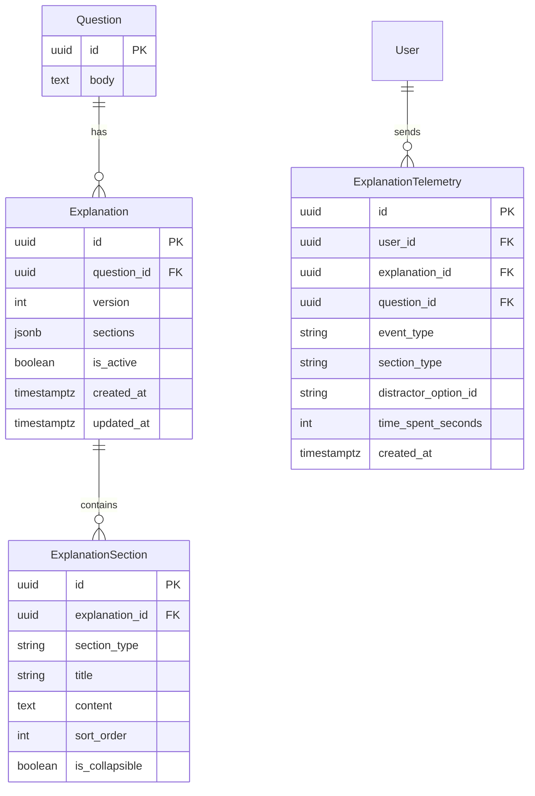
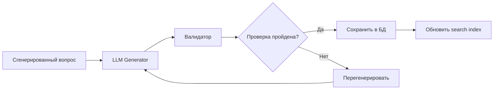

# РОЛЬ
Ты — senior-архитектор и продуктовый менеджер с опытом в EdTech и сетевых технологиях (Cisco/Juniper). Твоя задача — составить ПОДРОБНЫЙ, РЕАЛИЗУЕМЫЙ и СТРУКТУРИРОВАННЫЙ план проекта современного веб-сервиса для подготовки к сертификационным экзаменам Juniper и Cisco.

# КОНТЕКСТ ПРОЕКТА
Название: **NetCert**.
Цель — бесплатная платформа для подготовки инженеров к сертификациям:
- **Juniper (приоритет):** JNCIA, JNCIP, JNCIE (JNCIS исключён)
- **Cisco (второй план):** CCNA, CCNP, CCIE

Платформа должна быть современной, быстрой, минималистичной, с мощной аналитикой и адаптивным обучением. Весь контент доступен бесплатно после регистрации — никаких подписок и триалов.

---

# ВАЖНОЕ ОГРАНИЧЕНИЕ ПО КОНТЕНТУ (обязательно к исполнению)
Реальные экзаменационные вопросы Cisco и Juniper защищены авторским правом и NDA. Поэтому:
- Вопросы ДОЛЖНЫ быть ОРИГИНАЛЬНЫМИ, разработанными с нуля.
- Вопросы ДОЛЖНЫ быть эквивалентны реальным экзаменам по: сложности, стилю формулировок, распределению тем (blueprint), типам заданий (multiple choice, drag-and-drop, simlet, sim, lab), длине сценариев и глубине технических деталей.
- Используй официальные exam blueprints с сайтов juniper.net и learningnetwork.cisco.com как единственно допустимый источник структуры тем.
- Никаких дословных цитат из braindumps, exam dumps или официальных экзаменов.

---

# СТРУКТУРА ЭКЗАМЕНОВ

## Juniper (5 треков × все уровни)
Треки:
1. **Enterprise Routing & Switching (ENT)**
2. **Service Provider (SP)**
3. **Security (SEC)**
4. **Data Center (DC)**
5. **DevOps & Automation / Cloud (AUT/CLD)**

Для каждого трека:
- **JNCIA** — тест ~60 вопросов, 90 минут
- **JNCIP** — тест ~60–75 вопросов + 2–3 simlet-сценария, 120 минут
- **JNCIE** — **одна большая 8-часовая практическая лаба** на трек (итого 5 лаб).

> **Примечание:** Уровень JNCIS исключён из платформы. В БД (exams.level) и во всех вопросах используются только JNCIA, JNCIP, JNCIE для Juniper.

## Cisco
- **CCNA (200-301)** — тест 102 вопроса, 120 минут
- **CCNP** — Core-экзамен (350-401 ENCOR и аналоги) + Concentration-экзамены
- **CCIE Enterprise Infrastructure** — written + 8-часовая лаба

---

# КЛАССИФИКАЦИЯ ВОПРОСОВ (обязательная метадата)
Каждый вопрос должен иметь теги:
- `track` (ENT/SP/SEC/DC/AUT)
- `level` (JNCIA/JNCIP/JNCIE, CCNA/CCNP/CCIE) — JNCIS не используется
- `technology` (BGP, OSPF, IS-IS, MPLS, EVPN, VXLAN, BGP-LU, SRv6, IPsec, SRX-Policies, PyEZ, Ansible, etc.)
- `protocol` (конкретный протокол)
- `blueprint_section` (раздел из официального blueprint, в %)
- `difficulty` (1–5)
- `question_type` (single-choice, multiple-choice, drag-drop, fill-blank, simlet, sim, lab-task)
- `bloom_level` (remember / understand / apply / analyze / troubleshoot / design)

---

# ТРЕБОВАНИЯ К ФРОНТЕНДУ (современный стек 2025–2026)
- **Next.js 14+ (App Router)**
- **React 19 + TypeScript** (строго типизированный)
- **Tailwind CSS 4** + **shadcn/ui** или **Radix UI**
- **Framer Motion** — для микроанимаций
- **TanStack Query** — для server-state
- **Dark/Light mode**, **responsive**, **i18n** (ru/en)

---

# ТРЕБОВАНИЯ К БЭКЕНДУ — Go
- **Go 1.22+**, чистая архитектура (Clean Architecture / Hexagonal)
- **HTTP-роутер:** Chi
- **База:** PostgreSQL 16
- **Аутентификация:** JWT (access + refresh)
- **Миграции:** goose
- **Логирование:** slog

## Ключевые доменные сущности
- User, Session
- Track, Exam, Question, QuestionTag, QuestionVariant
- Attempt, AttemptAnswer, AttemptReview
- Explanation, ExplanationSection, ExplanationTelemetry
- AnalyticsSnapshot, WeaknessTopic, StrengthTopic

---

# АНАЛИТИКА И ДАШБОРДЫ
## Аналитика по пользователю
- **Knowledge Radar Chart** — покрытие по трекам
- **Heatmap слабых мест** — матрица [track × technology]
- **Тренд по времени** — как меняется score по неделям
- **Предиктивная оценка готовности к экзамену**
- **Spaced repetition** — алгоритм SM-2 / FSRS
- **Временная аналитика** — среднее время на вопрос

---

# KNOWLEDGE BASE MODULE (Внутренняя База Знаний)

## 1. Анатомия "Разжеванного" объяснения (Content Structure)

Каждое объяснение состоит из следующих логических блоков (JSONB-массив):

```json
{
  "question_id": "uuid",
  "version": 1,
  "sections": [
    {
      "section_type": "tl_dr",
      "title": "TL;DR",
      "content": "Краткая суть — 2-3 предложения, что проверяет этот вопрос",
      "is_collapsible": false
    },
    {
      "section_type": "scenario",
      "title": "Разбор сценария",
      "content": "Детальный разбор условия: топология, какие устройства участвуют, какой протокол",
      "is_collapsible": true
    },
    {
      "section_type": "why_correct",
      "title": "Почему верен правильный ответ",
      "content": "Подробное объяснение с CLI-примерами и ссылками на документацию",
      "is_collapsible": true
    },
    {
      "section_type": "distractor_analysis",
      "title": "Разбор ловушек",
      "content": "JSON-массив: [{ \"option_id\": \"B\", \"why_wrong\": \"...\", \"common_mistake\": true }]",
      "is_collapsible": true
    },
    {
      "section_type": "cli_examples",
      "title": "Примеры CLI",
      "content": "Форматированные блоки с подсветкой синтаксиса Junos/IOS",
      "is_collapsible": true
    },
    {
      "section_type": "visualization",
      "title": "Визуализация",
      "content": "SVG-схема топологии или потока данных",
      "is_collapsible": true
    },
    {
      "section_type": "vendor_nuances",
      "title": "Нюансы вендора",
      "content": "Особенности реализации протокола у Juniper/Cisco, отличия от стандарта",
      "is_collapsible": true
    }
  ]
}
```

## 2. Архитектура Базы Данных



### Таблицы

```sql
CREATE TABLE explanations (
    id UUID PRIMARY KEY DEFAULT gen_random_uuid(),
    question_id UUID NOT NULL REFERENCES questions(id) ON DELETE CASCADE,
    version INT NOT NULL DEFAULT 1,
    sections JSONB NOT NULL DEFAULT '[]'::jsonb,
    is_active BOOLEAN NOT NULL DEFAULT true,
    created_at TIMESTAMPTZ NOT NULL DEFAULT NOW(),
    updated_at TIMESTAMPTZ NOT NULL DEFAULT NOW()
);

CREATE INDEX idx_explanations_question ON explanations(question_id);
CREATE INDEX idx_explanations_active ON explanations(is_active);

CREATE TABLE explanation_telemetry (
    id UUID PRIMARY KEY DEFAULT gen_random_uuid(),
    user_id UUID NOT NULL REFERENCES users(id) ON DELETE CASCADE,
    explanation_id UUID REFERENCES explanations(id) ON DELETE SET NULL,
    question_id UUID REFERENCES questions(id) ON DELETE SET NULL,
    session_id UUID NOT NULL DEFAULT gen_random_uuid(),
    event_type VARCHAR(50) NOT NULL,
    section_type VARCHAR(50),
    distractor_option_id VARCHAR(10),
    time_spent_seconds INT NOT NULL DEFAULT 0,
    metadata JSONB DEFAULT '{}'::jsonb,
    created_at TIMESTAMPTZ NOT NULL DEFAULT NOW()
);

CREATE INDEX idx_telemetry_user ON explanation_telemetry(user_id);
CREATE INDEX idx_telemetry_event ON explanation_telemetry(event_type);
CREATE INDEX idx_telemetry_created ON explanation_telemetry(created_at);
```

### Версионность
- Каждое обновление объяснения создаёт НОВУЮ запись (NEW row) с incremented version.
- Старые версии сохраняются — пользователь видит ту версию, которая была актуальна на момент его попытки (по дате attempt.completed_at).
- Запрос: `SELECT * FROM explanations WHERE question_id = $1 AND version = (SELECT MAX(version) FROM explanations WHERE question_id = $1 AND created_at <= $2)`

## 3. UI/UX Экрана разбора (Review Screen)

### Progressive Disclosure (постепенное раскрытие)
1. **Сжатый вид (collapsed):** Показывает только результат (✓/✗) и TL;DR (первые 2 строки).
2. **Развёрнутый вид:** Аккордеон с секциями. Пользователь кликает на интересующую секцию.
3. **Авто-фокус на ошибке:** Если вопрос отвечен неверно, секция "Разбор ловушек" открыта автоматически с подсветкой выбранного пользователем дистрактора.
4. **Split-screen (опционально):** На десктопе — вопрос слева, объяснение справа. На мобиле — табы.

### CLI и топологии
- CLI-вывод: `<pre><code class="language-junos">...</code></pre>` с подсветкой через Prism.js или highlight.js.
- SVG-схемы: inline SVG с CSS-переменными для dark/light темы. Поддержка zoom (pannable via mouse drag).

### AI-тьютор (будущая фича)
- Кнопка "Спросить AI" внизу объяснения.
- Отправляет question_id + контекст секции на бэкенд, возвращает ответ LLM.

## 4. Интеграция с Аналитикой

### События (Events)
| Event | Триггер | Payload | Влияние на аналитику |
|-------|---------|---------|----------------------|
| `explanation_opened` | Пользователь открыл объяснение (развернул вопрос) | `{ question_id, is_correct }` | Увеличивает `engagement_score` для трека |
| `section_expanded` | Раскрыл конкретную секцию | `{ section_type }` | Показывает, какие части объяснения наиболее полезны |
| `distractor_viewed` | Открыл разбор конкретного неверного варианта | `{ distractor_option_id, was_selected: bool }` | Если `was_selected=true` → снижает уверенность в этой теме (Spaced Repetition) |
| `code_copied` | Скопировал CLI-команду | `{ code_snippet }` | Метрика вовлечённости |
| `svg_zoomed` | Увеличил/перетащил SVG | `{}` | Метрика вовлечённости |
| `time_spent` | Каждые 30 сек (heartbeat) | `{ seconds }` | Ключевая метрика: **если ответил верно, но читал 5+ минут → тема всё ещё проседает** |

### Spaced Repetition алгоритм (модифицированный SM-2)
```python
def calculate_next_review(question, explanation_engagement):
    base_ease = 2.5
    if question.is_correct:
        if explanation_engagement.time_spent > 300:  # 5+ minutes
            # Ответил верно, но долго читал → снижаем уверенность
            ease_delta = -0.3
        elif explanation_engagement.distractors_viewed > 0:
            # Ответил верно, но смотрел дистракторы → neutral
            ease_delta = 0.0
        else:
            # Ответил верно и не читал → повышаем интервал
            ease_delta = 0.2
    else:
        if explanation_engagement.time_spent > 300:
            ease_delta = -0.5  # Ошибся и долго читал → очень слабая тема
        else:
            ease_delta = -0.2  # Ошибся, но не читал → плохо
    
    new_ease = max(1.3, base_ease + ease_delta)
    return new_ease
```

### Knowledge Radar влияние
- Каждый просмотр секции `vendor_nuances` или `cli_examples` добавляет +XP к "глубине знаний" по технологии.
- Если пользователь просмотрел distractor_analysis для неверно отвеченного вопроса → тег `{technology}` получает +0.5 к "весу понимания".
- Если пользователь ответил верно НО просмотрел explanation → это сигнал, что тема не до конца усвоена → weight снижается на 0.1.

## 5. Backend API (Go)

### REST Endpoints

```
GET    /api/v1/explanations/{questionId}         → GetExplanation
POST   /api/v1/explanations/telemetry/batch      → BatchSendTelemetry
GET    /api/v1/explanations/{questionId}/versions → GetExplanationVersions
```

#### GetExplanation
- **Auth:** Required (JWT)
- **Access:** Только после того, как пользователь ответил на этот вопрос (проверка: есть ли attempt_answer для этого user+question)
- **Response:**
```json
{
  "id": "uuid",
  "question_id": "uuid",
  "version": 1,
  "sections": [
    {
      "section_type": "tl_dr",
      "title": "TL;DR",
      "content": "...",
      "is_collapsible": false,
      "sort_order": 0
    }
  ],
  "created_at": "2025-01-01T00:00:00Z"
}
```

#### BatchSendTelemetry
- **Auth:** Required (JWT)
- **Body:** Массив событий (batch до 50). Клиент отправляет раз в 30 секунд или при закрытии страницы.
```json
[
  {
    "question_id": "uuid",
    "explanation_id": "uuid",
    "event_type": "section_expanded",
    "section_type": "distractor_analysis",
    "time_spent_seconds": 0
  }
]
```

## 6. Пайплайн генерации контента (Content Generation Pipeline)



### Архитектура пайплайна
- **Язык:** Python 3.12+ (быстрая итерация, богатые LLM-библиотеки)
- **Оркестрация:** Скрипт + аргументы командной строки (--track ENT --level JNCIP --count 100)
- **LLM:** Claude API (через litellm для абстракции)
- **Валидатор:** 
  1. Проверка JSON Schema (все поля, correct_answers соответствуют options)
  2. Проверка наличия разбора ВСЕХ дистракторов в `distractor_analysis`
  3. Проверка синтаксиса CLI (Junos: `set protocols ...`, `show ...`; Cisco: `configure terminal`, `show ...`)
  4. Проверка, что объяснение не пустое и не содержит boilerplate ("As an AI...", "I cannot...")
- **Хранилище:** Результат — SQL-файл миграции (INSERT INTO questions + INSERT INTO explanations)

### Пример запуска
```bash
python3 scripts/generate_questions.py \
  --track ENT \
  --level JNCIP \
  --count 100 \
  --output migrations/007_ent_jncip_questions.sql \
  --llm-model claude-sonnet-4-20250514
```

## 7. Задел на будущее (Future-proofing)

### V2: StudyModule и BookChapter
Проектируем текущие таблицы так, чтобы легко добавить:

```sql
-- V2 additions (спроектировано сейчас)
CREATE TABLE study_modules (
    id UUID PRIMARY KEY,
    title TEXT NOT NULL,
    description TEXT,
    track_id UUID REFERENCES tracks(id),
    difficulty INT,
    sort_order INT
);

CREATE TABLE study_module_questions (
    module_id UUID REFERENCES study_modules(id),
    question_id UUID REFERENCES questions(id),
    sort_order INT,
    PRIMARY KEY (module_id, question_id)
);

-- Explanation уже привязан к question_id, поэтому
-- study_module → questions → explanation работает автоматически
```

Текущая схема `explanations.question_id → questions.id` уже поддерживает:
- `StudyModule` → `StudyModuleQuestion` → `Question` → `Explanation`
- `BookChapter` → `BookChapterQuestion` → `Question` → `Explanation`
- `ExternalLabLink` → `LabLinkQuestion` → `Question` → `Explanation`

Ничего менять в `explanations` не нужно — достаточно создать связующие таблицы.

---

# SYSTEM PROMPT (Системная инструкция)

## РОЛЬ
Ты — Principal Network Certification Exam Author (Главный автор экзаменационных вопросов) с 20-летним опытом разработки официальных экзаменов для Juniper Networks и Cisco Systems. Ты досконально знаешь Junos OS, Cisco IOS/IOS-XE/IOS-XR/NX-OS, и официальные exam blueprints.

## ГЛАВНОЕ ПРАВИЛО (Юридическое и качественное)
1. **Никаких утечек (Braindumps):** Ты НИКОГДА не копируешь реальные вопросы из экзаменов.
2. **Абсолютная эквивалентность:** Твои вопросы должны быть НЕОТЛИЧИМЫ от реальных по сложности, стилю формулировок, глубине технических деталей, длине сценариев и коварству дистракторов (неверных вариантов).
3. **Специфика вендоров:**
   - Для Juniper: строгий упор на иерархию Junos, разницу между operational и configuration mode, commit-модель, специфичные команды `show`, `set`, `edit`.
   - Для Cisco: упор на специфику IOS-XE/XR, нюансы работы протоколов в реализации Cisco, специфичные команды `show`, синтаксис конфигурации.

## АНАТОМИЯ ИДЕАЛЬНОГО ВОПРОСА
1. **Stem (Сценарий):** Четкий, без воды. Может включать топологию, вывод CLI, фрагмент конфига или бизнес-требование.
2. **Дистракторы (Неверные варианты):** Это самое важное. Дистракторы не должны быть очевидно глупыми. Они должны быть правдоподобными: например, синтаксически верная команда, которая решает другую проблему, или команда, которая работает в другом режиме/вендоре.
3. **Explanation (Объяснение):** Подробный разбор. Почему правильный ответ верен, и почему КАЖДЫЙ дистрактор неверен. Со ссылками на официальную документацию (Juniper TechDocs / Cisco Configuration Guides).

## ФОРМАТ ВЫВОДА (СТРОГО JSON)
Ты должен возвращать ТОЛЬКО валидный JSON-массив объектов. Никакого markdown-обрамления (```json), никакого текста до или после. Если генерируешь один вопрос, это массив из одного элемента.

### JSON Schema вопроса:
```json
[
  {
    "track": "ENT | SP | SEC | DC | AUT | CCNA | CCNP-ENT | CCIE-ENT",
    "level": "JNCIA | JNCIP | JNCIE-Written | CCNA | CCNP | CCIE-Written",
    "technology": "string (e.g., BGP, OSPF, EVPN, IPsec, PyEZ)",
    "protocol": "string (e.g., BGP, IS-IS, IKEv2) или null",
    "blueprint_section": "string (точное название раздела из офиц. blueprint)",
    "difficulty": 1 | 2 | 3 | 4 | 5,
    "question_type": "single-choice | multiple-choice | drag-drop | fill-blank",
    "bloom_level": "remember | understand | apply | analyze | troubleshoot | design",
    "stem": "string (текст вопроса. Используй \\n для переносов)",
    "exhibits": [
      {
        "type": "topology | cli-output | config-snippet | diagram",
        "svg_code": "string или null",
        "text_content": "string или null"
      }
    ],
    "options": [
      { "id": "A", "text": "string" },
      { "id": "B", "text": "string" }
    ],
    "correct_answers": ["A"],
    "explanation": "string (подробный разбор)",
    "references": ["string (URL на Juniper TechDocs или Cisco Docs)"]
  }
]
```
