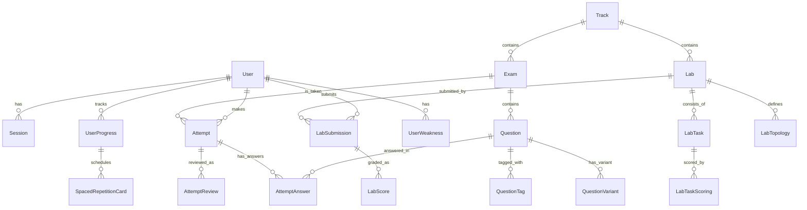
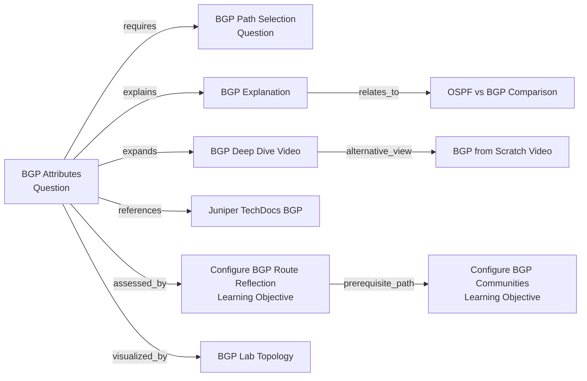
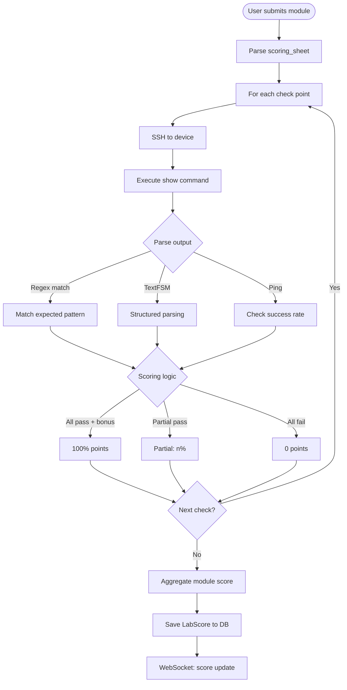

# NetCert — Полный план проекта

> Версия: 1.0  
> Дата: Май 2026  
> Статус: Черновик архитектуры

---

## 1. Executive Summary

**NetCert** — это бесплатная платформа для подготовки инженеров к сертификационным экзаменам Juniper (JNCIA–JNCIE, 5 треков) и Cisco (CCNA–CCIE). Продукт решает ключевую проблему рынка: отсутствие качественных, легальных, структурно полных инструментов подготовки, эквивалентных реальным экзаменам. Платформа сочетает адаптивное тестирование с оригинальными вопросами (blueprint-совместимыми, без нарушения NDA), продвинутую аналитику на основе FSRS (spaced repetition), и интерактивный lab-движок для 8-часовых практических экзаменов уровня JNCIE/CCIE на базе Containerlab. Технический стек — Next.js 16 + React 19 (фронтенд), Go 1.22+ с чистой архитектурой (бэкенд), PostgreSQL 16 + pgvector + Redis (хранение и кэш), и Kubernetes (продакшн). Доступ ко всем материалам бесплатный — только регистрация.

---

## 2. Целевая аудитория и УТП

### Целевая аудитория

| Сегмент | Описание | Размер рынка (оценка) | Платежеспособность |
|---------|----------|----------------------|-------------------|
| **Инженеры Juniper (ядро)** | Сетевые инженеры, готовящиеся к JNCIA–JNCIE. Часто уже работают в SP/Telco. | ~150–200K активных ежегодно | Средняя–высокая |
| **Инженеры Cisco** | Инженеры enterprise, готовящиеся к CCNA–CCIE | ~500K–1M ежегодно | Средняя |
| **Тренинг-центры (B2B)** | Авторизованные учебные центры (Juniper ATP, Cisco Learning Partner) | ~500–800 центров globally | Высокая |
| **Корпоративные клиенты** | ISP/MSP, Telco, предприятия с штатом сетевых инженеров | ~2000+ компаний | Высокая |

### УТП (Уникальное торговое предложение)

1. **Blueprint-эквивалентный контент без нарушения NDA** — все вопросы разработаны с нуля, но полностью покрывают official blueprint по сложности и темам.
2. **Адаптивное обучение на базе FSRS** — алгоритм spaced repetition нового поколения, персонализирующий интервалы повторения под каждого пользователя (на 20–30% эффективнее SM-2).
3. **Реалистичные JNCIE/CCIE лабы** — изолированные pod'ы на Containerlab с Web-терминалами (xterm.js), auto-grading, injected faults, scoring sheet — всё как на реальном экзамене.
4. **Премиальная аналитика** — heatmap слабых мест, предиктивная оценка готовности, Knowledge Radar Chart, временна́я аналитика.
5. **Омниканальность** — PWA (офлайн-тесты), десктоп (Electron опционально), mobile-first responsive дизайн.

---

## 3. High-level архитектура

### Контейнерная диаграмма (C4 — Level 1)

```mermaid
flowchart TB
    subgraph "User Layer"
        A[Browser / PWA]
        B[Web Terminal xterm.js]
    end

    subgraph "CDN / Edge"
        C[Cloudflare CDN<br/>Edge Middleware]
    end

    subgraph "Frontend (Next.js 16)"
        D[Next.js App Router<br/>React 19 + RSC]
        E[Tailwind CSS v4 + shadcn/ui]
        F[TanStack Query<br/>Zustand]
        G[Motion (Framer Motion)]
    end

    subgraph "API Gateway"
        H[Go API Gateway<br/>(Chi Router)]
        I[JWT Auth Middleware]
        J[Rate Limiter<br/>(Redis)]
    end

    subgraph "Backend Services"
        K[User Service<br/>Go]
        L[Exam Engine Service<br/>Go]
        M[Analytics Service<br/>Go]
        N[Lab Orchestrator<br/>Go]
        O[Content Service<br/>Go]
    end

    subgraph "Async / Stream"
        Q[NATS JetStream]
        R[WebSocket Hub<br/>Go]
    end

    subgraph "Data Layer"
        S[(PostgreSQL 16<br/>+ pgvector)]
        T[(Redis)]
        U[MinIO / S3<br/>Lab artifacts]
    end

    subgraph "Lab Infrastructure"
        V[Containerlab<br/>cRPD / vMX / XRv9k]
        W[Docker Pod per User]
    end

    subgraph "Monitoring"
        X[Prometheus + Grafana]
        Y[Loki / Tempo]
        Z[OpenTelemetry]
    end

    A --> C
    C --> D
    D --> H
    B --> R
    H --> I
    I --> J
    J --> K
    J --> L
    J --> M
    J --> N
    J --> O
    K --> S
    K --> T
    L --> S
    L --> T
    M --> S
    M --> Q
    N --> V
    N --> Q
    N --> W
    O --> S
    O --> U
    R --> N
    Q --> M
    K --> X
    L --> X
    M --> X
    N --> X
```

### Описание потоков

1. **Пользователь → Браузер → Next.js (SSR/RSC)** → API Gateway (Chi) → Сервисы (Go) → PostgreSQL/Redis
2. **Exam Mode** → WebSocket для синхронизации таймера и состояния сессии
3. **Lab Engine** → WebSocket (xterm.js) → Lab Orchestrator → Containerlab Pod
4. **Аналитика** → NATS JetStream → async workers → обновление дашбордов
5. **FSRS Optimizer** → Kafka-подобная очередь → batch training → обновление параметров

---

## 4. Стек технологий (с обоснованием)

### Фронтенд

| Компонент | Выбор | Обоснование |
|-----------|-------|-------------|
| **Фреймворк** | Next.js 16 (App Router) | SSR + RSC — критично для SEO и быстрой загрузки. Unified codebase для marketing + app (в отличие от Astro, где маркетинг и app разделены). Turbopack для быстрой сборки. |
| **UI Библиотека** | React 19 + TypeScript (strict) | Стандарт индустрии 2026. React Server Components снижают JS-бандл на 30–50%. |
| **CSS** | Tailwind CSS v4 | Конфигурация через CSS-файлы (без tailwind.config.js), быстрее сборки, утилитарный подход. |
| **Компоненты** | shadcn/ui (Radix UI) | Полный контроль над кодом (не зависимость, а source code), доступность (WCAG 2.2 AA), кастомизация под бренд. "Lingua franca" UI-разработки 2026. |
| **Анимации** | Motion (бывш. Framer Motion) | Лёгкая библиотека physics-based анимаций. Микроанимации для переходов, hover-эффектов, экранных состояний. |
| **Server State** | TanStack Query v5 | Кэширование, дедупликация запросов, optimistic updates, infinite scroll для списка вопросов. |
| **Client State** | Zustand | Минимальный boilerplate, встроенная поддержка persistence (localStorage для офлайн-режима). |
| **Валидация** | Zod + React Hook Form | Runtime-валидация на клиенте и сервере (через shared schemas). |
| **Терминал** | xterm.js + @xterm/addon-webgl | Web-терминал для lab-сессий. WebGL-рендеринг для производительности. |
| **Схемы сетей** | React Flow (на базе D3.js) | Интерактивные топологии сетей. Поддержка dark/light theme, кастомные ноды. |
| **Чарты/Графики** | Recharts + nivo | Recharts — стандартные графики (line, bar, radar, heatmap). nivo — сложные кастомные визуализации (sankey, chord). |
| **PWA** | next-pwa + Service Workers | Офлайн-прохождение тестов. Кэширование вопросов и ответов. |
| **i18n** | next-intl | Интернационализация (ru/en). Статическая генерация словарей. |

### Бэкенд

| Компонент | Выбор | Обоснование |
|-----------|-------|-------------|
| **Язык** | Go 1.22+ | Производительность, простота деплоя (single binary), отличная поддержка конкурентности. Идеален для чистой архитектуры. |
| **HTTP-роутер** | Chi | Наиболее идиоматичный выбор для чистой архитектуры: совместим с `net/http`, не навязывает собственный Context (в отличие от Echo), отличная поддержка middleware-композиции. |
| **Архитектура** | Clean / Hexagonal | Domain → Use Cases → Delivery (HTTP/gRPC). Полная изоляция бизнес-логики от фреймворков. |
| **База данных** | PostgreSQL 16 + pgvector | Векторный поиск для семантического поиска вопросов и AI-рекомендаций в будущем. |
| **Кэш** | Redis 7 | Сессии, rate-limiting, leaderboard, кэш вопросов. |
| **Очереди** | NATS JetStream | Лёгкий, высокопроизводительный message broker для асинхронных задач (генерация отчётов, FSRS-оптимизация, email-нотификации). |
| **Аутентификация** | JWT (access + refresh) + OAuth2 + WebAuthn | Access token (15 мин) + Refresh token (7 дней) с rotation. OAuth2 через Google/GitHub. Passkeys через WebAuthn для passwordless auth. |
| **RBAC** | Кастомный middleware | Роли: student / instructor / admin. Права на уровне middleware и domain. |
| **Автодокументация** | OpenAPI 3.0 + oapi-codegen | OpenAPI 3.1 пока не имеет стабильной поддержки в Go-экосистеме. Используем 3.0 с генерацией через oapi-codegen. |
| **Миграции** | goose | Простой, декларативный, version-based. SQL-файлы в репозитории. |
| **Логирование** | slog (structured) + OpenTelemetry | Структурированные логи в JSON. Distributed tracing через OTel. |
| **Тестирование** | testify + sqlc + testcontainers-go | SQL-генерация через sqlc. Интеграционные тесты с testcontainers (PostgreSQL, Redis в контейнерах). |
| **gRPC** | gRPC-Go + protobuf | Внутренняя коммуникация между микросервисами. Стриминг для lab-логов. |

### Инфраструктура

| Компонент | Выбор |
|-----------|-------|
| **Контейнеризация** | Docker + docker-compose (dev) |
| **Оркестрация** | Kubernetes (K3s для staging, EKS/GKE для prod) |
| **Helm-чарты** | Кастомные чарты для каждого сервиса |
| **CI/CD** | GitHub Actions |
| **IaC** | Terraform (Pulumi опционально) |
| **Мониторинг** | Prometheus + Grafana (метрики), Loki (логи), Tempo (трейсы) |
| **CDN** | Cloudflare |
| **Объектное хранилище** | MinIO (dev), AWS S3 / Cloudflare R2 (prod) |

---

## 5. Структура БД

### ER-диаграмма



### Ключевые таблицы

#### `users`
| Колонка | Тип | Описание |
|---------|-----|----------|
| id | UUID (PK) | Первичный ключ |
| email | VARCHAR(255) UNIQUE | Email |
| password_hash | VARCHAR(255) | BCrypt hash |
| display_name | VARCHAR(100) | Отображаемое имя |
| role | ENUM('student','instructor','admin') | Роль |
| avatar_url | TEXT | Ссылка на аватар |
| oauth_provider | VARCHAR(50) | google / github |
| oauth_id | VARCHAR(255) | ID от провайдера |
| webauthn_credential_id | TEXT | Passkeys |
| is_email_verified | BOOLEAN | Подтверждение email |
| streak_days | INT | Текущая серия дней |
| total_xp | BIGINT | Суммарный опыт |
| created_at | TIMESTAMPTZ | Дата создания |
| updated_at | TIMESTAMPTZ | Дата обновления |

#### `tracks`
| Колонка | Тип | Описание |
|---------|-----|----------|
| id | UUID (PK) | |
| slug | VARCHAR(20) UNIQUE | `junos-ent`, `junos-sp`, `junos-sec`, `junos-dc`, `junos-aut`, `cisco-ccna`, `cisco-ccnp`, `cisco-ccie` |
| vendor | ENUM('juniper','cisco') | |
| name | VARCHAR(100) | `JNCIA-Junos`, `CCNA` и т.д. |
| description | TEXT | |
| icon_url | TEXT | SVG-иконка |
| sort_order | INT | Порядок сортировки |

#### `exams`
| Колонка | Тип | Описание |
|---------|-----|----------|
| id | UUID (PK) | |
| track_id | UUID (FK → tracks) | |
| code | VARCHAR(20) UNIQUE | `JN0-101`, `200-301` |
| name | VARCHAR(200) | |
| level | ENUM('JNCIA','JNCIS','JNCIP','JNCIE','CCNA','CCNP','CCIE') | |
| duration_minutes | INT | |
| total_questions | INT | |
| passing_score | DECIMAL(5,2) | Процент прохода |
| blueprint_url | TEXT | Ссылка на official blueprint |
| is_active | BOOLEAN | |

#### `questions`
| Колонка | Тип | Описание |
|---------|-----|----------|
| id | UUID (PK) | |
| exam_id | UUID (FK → exams) | |
| track_id | UUID (FK → tracks) | |
| question_type | ENUM('single-choice','multiple-choice','drag-drop','fill-blank','simlet','sim','lab-task') | |
| difficulty | SMALLINT | 1–5 |
| bloom_level | ENUM('remember','understand','apply','analyze','troubleshoot','design') | |
| body | JSONB | Содержимое вопроса (текст, схемы, код) |
| explanation | TEXT | Подробное объяснение |
| reference_urls | TEXT[] | Ссылки на Juniper TechDocs / Cisco docs |
| blueprint_section | VARCHAR(100) | Раздел blueprint |
| blueprint_weight | DECIMAL(5,2) | % веса в экзамене |
| is_original | BOOLEAN | Маркер оригинальности |
| is_active | BOOLEAN | |
| encrypted_content | BYTEA | Зашифрованная копия для защиты |
| content_hash | VARCHAR(64) | SHA-256 хеш контента |
| created_at | TIMESTAMPTZ | |
| updated_at | TIMESTAMPTZ | |

#### `question_tags`
| Колонка | Тип | Описание |
|---------|-----|----------|
| id | UUID (PK) | |
| question_id | UUID (FK → questions) | |
| technology | VARCHAR(50) | `BGP`, `OSPF`, `MPLS`, `EVPN`, etc. |
| protocol | VARCHAR(50) | Конкретный протокол |

#### `question_variants`
| Колонка | Тип | Описание |
|---------|-----|----------|
| id | UUID (PK) | |
| question_id | UUID (FK → questions) | |
| variant_data | JSONB | Вариация (параметры, подсети, IP) |
| correct_answer | JSONB | |
| explanation | TEXT | |

#### `attempts`
| Колонка | Тип | Описание |
|---------|-----|----------|
| id | UUID (PK) | |
| user_id | UUID (FK → users) | |
| exam_id | UUID (FK → exams) | |
| status | ENUM('in_progress','paused','completed','timed_out','abandoned') | |
| started_at | TIMESTAMPTZ | |
| completed_at | TIMESTAMPTZ | |
| duration_seconds | INT | |
| score | DECIMAL(5,2) | % правильных |
| questions_total | INT | |
| questions_answered | INT | |
| questions_correct | INT | |
| questions_flagged | INT[] | ID вопросов, отмеченных флагом |
| device_info | JSONB | Информация об устройстве |
| ip_address | INET | Для anti-cheat |

#### `attempt_answers`
| Колонка | Тип | Описание |
|---------|-----|----------|
| id | UUID (PK) | |
| attempt_id | UUID (FK → attempts) | |
| question_id | UUID (FK → questions) | |
| variant_id | UUID (FK → question_variants) | |
| user_answer | JSONB | |
| is_correct | BOOLEAN | |
| time_spent_seconds | INT | |
| was_flagged | BOOLEAN | |
| created_at | TIMESTAMPTZ | |

#### `attempt_reviews`
| Колонка | Тип | Описание |
|---------|-----|----------|
| id | UUID (PK) | |
| attempt_id | UUID (FK → attempts) | |
| user_id | UUID (FK → users) | |
| question_id | UUID (FK → questions) | |
| user_notes | TEXT | Заметки пользователя |
| is_bookmarked | BOOLEAN | Закладка |
| rating | SMALLINT | Оценка вопроса (1–5) |
| created_at | TIMESTAMPTZ | |

#### `labs`
| Колонка | Тип | Описание |
|---------|-----|----------|
| id | UUID (PK) | |
| track_id | UUID (FK → tracks) | |
| exam_code | VARCHAR(20) | `JNCIE-ENT`, `CCIE-EI` |
| name | VARCHAR(200) | |
| duration_minutes | INT | 480 (8 часов) |
| topology_yaml | TEXT | Containerlab topology YAML |
| topology_svg | TEXT | SVG-схема топологии |
| task_book_url | TEXT | PDF с заданиями |
| scoring_sheet | JSONB | Критерии оценки |
| max_score | INT | |
| passing_score | INT | |
| num_devices | INT | 6–10 |
| num_tasks | INT | 10–15 |
| has_injected_faults | BOOLEAN | |
| is_active | BOOLEAN | |

#### `lab_tasks`
| Колонка | Тип | Описание |
|---------|-----|----------|
| id | UUID (PK) | |
| lab_id | UUID (FK → labs) | |
| module_number | INT | 1–15 |
| title | VARCHAR(200) | |
| description | TEXT | |
| task_type | ENUM('build','troubleshoot','config','verify') | |
| scoring_criteria | JSONB | |
| max_points | INT | |
| fault_description | TEXT | Описание injected fault (если есть) |

#### `lab_task_scoring`
| Колонка | Тип | Описание |
|---------|-----|----------|
| id | UUID (PK) | |
| lab_task_id | UUID (FK → lab_tasks) | |
| check_command | VARCHAR(200) | `show bgp summary`, `ping 10.0.0.1` |
| expected_output | TEXT | Regex или exact match |
| points | INT | |
| is_auto_gradable | BOOLEAN | |

#### `lab_submissions`
| Колонка | Тип | Описание |
|---------|-----|----------|
| id | UUID (PK) | |
| lab_id | UUID (FK → labs) | |
| user_id | UUID (FK → users) | |
| pod_id | VARCHAR(50) | ID Containerlab pod |
| status | ENUM('running','paused','completed','timed_out') | |
| started_at | TIMESTAMPTZ | |
| completed_at | TIMESTAMPTZ | |
| time_remaining_seconds | INT | |
| snapshot_id | VARCHAR(100) | ID снапшота для отката |

#### `lab_scores`
| Колонка | Тип | Описание |
|---------|-----|----------|
| id | UUID (PK) | |
| submission_id | UUID (FK → lab_submissions) | |
| task_id | UUID (FK → lab_tasks) | |
| task_score | INT | |
| max_score | INT | |
| scoring_output | JSONB | Результаты проверки |
| is_autograded | BOOLEAN | |
| created_at | TIMESTAMPTZ | |

#### `spaced_repetition_cards`
| Колонка | Тип | Описание |
|---------|-----|----------|
| id | UUID (PK) | |
| user_id | UUID (FK → users) | |
| question_id | UUID (FK → questions) | |
| stability | DECIMAL(10,4) | Параметр FSRS |
| difficulty | DECIMAL(4,2) | Параметр FSRS |
| elapsed_days | INT | |
| scheduled_days | INT | |
| last_reviewed_at | TIMESTAMPTZ | |
| next_review_at | TIMESTAMPTZ | |
| review_count | INT | |
| fsrs_params | JSONB | Индивидуальные параметры FSRS |
| created_at | TIMESTAMPTZ | |
| updated_at | TIMESTAMPTZ | |

#### `user_progress`
| Колонка | Тип | Описание |
|---------|-----|----------|
| id | UUID (PK) | |
| user_id | UUID (FK → users) | |
| track_id | UUID (FK → tracks) | |
| exam_id | UUID (FK → exams) | |
| coverage_percent | DECIMAL(5,2) | |
| accuracy_rolling | DECIMAL(5,2) | Скользящая точность |
| questions_attempted | INT | |
| questions_correct | INT | |
| predicted_readiness | DECIMAL(5,2) | 0–100% |
| total_study_time_minutes | BIGINT | |
| last_activity_at | TIMESTAMPTZ | |

#### `user_weaknesses`
| Колонка | Тип | Описание |
|---------|-----|----------|
| id | UUID (PK) | |
| user_id | UUID (FK → users) | |
| track_id | UUID (FK → tracks) | |
| technology | VARCHAR(50) | |
| weakness_score | DECIMAL(5,2) | Ниже = слабее |
| last_assessed_at | TIMESTAMPTZ | |

---

## 6. API-контракт

### REST API (ключевые endpoints)

#### Примеры запросов/ответов (ключевые операции)

**POST /api/v1/auth/register** — Регистрация
```json
// Request
{
  "email": "user@example.com",
  "password": "SecurePass123!",
  "display_name": "Ivan Petrov",
  "accept_terms": true
}

// Response 201
{
  "user": {
    "id": "uuid",
    "email": "user@example.com",
    "display_name": "Ivan Petrov",
    "role": "student",
    "created_at": "2026-05-20T10:00:00Z"
  },
  "tokens": {
    "access_token": "jwt...",
    "refresh_token": "jwt...",
    "expires_in": 900
  }
}

// Error 409
{
  "error": "email_already_exists",
  "message": "User with this email already registered"
}
```

**POST /api/v1/attempts** — Начать сессию
```json
// Request
{
  "exam_id": "uuid",
  "mode": "exam", // "exam" | "practice" | "timed"
  "shuffle_questions": true,
  "time_limit_minutes": 90
}

// Response 201
{
  "attempt_id": "uuid",
  "status": "in_progress",
  "started_at": "2026-05-20T10:00:00Z",
  "time_remaining_seconds": 5400,
  "questions": [
    {
      "id": "uuid",
      "order": 1,
      "type": "single-choice",
      "body": {
        "text": "Which statement about BGP is correct?",
        "options": [
          {"id": "a", "text": "BGP uses OSPF as transport"},
          {"id": "b", "text": "BGP is a path-vector protocol"},
          {"id": "c", "text": "BGP operates at layer 2"},
          {"id": "d", "text": "BGP uses RIP for loop prevention"}
        ],
        "has_diagram": false
      }
    }
  ],
  "total_questions": 60
}
```

**POST /api/v1/attempts/{attemptId}/answers** — Отправить ответ
```json
// Request
{
  "question_id": "uuid",
  "variant_id": "uuid",
  "answer": {"selected_option": "b"},
  "time_spent_seconds": 45,
  "was_flagged": false
}

// Response 200
{
  "answer_id": "uuid",
  "question_order": 1,
  "is_correct": null, // null до завершения сессии
  "next_question": {
    "id": "uuid",
    "order": 2
  }
}
```

#### Аутентификация

| Method | Path | Описание | Auth |
|--------|------|----------|------|
| POST | `/api/v1/auth/register` | Регистрация | — |
| POST | `/api/v1/auth/login` | Вход (email + password) | — |
| POST | `/api/v1/auth/oauth/{provider}` | OAuth2 вход | — |
| POST | `/api/v1/auth/refresh` | Refresh token | Refresh |
| POST | `/api/v1/auth/logout` | Выход | Access |
| POST | `/api/v1/auth/webauthn/register` | Регистрация Passkey | Access |
| POST | `/api/v1/auth/webauthn/authenticate` | Аутентификация Passkey | — |
| POST | `/api/v1/auth/password/reset` | Сброс пароля | — |

#### Пользователи

| Method | Path | Описание | Auth |
|--------|------|----------|------|
| GET | `/api/v1/users/me` | Профиль | Access |
| PATCH | `/api/v1/users/me` | Обновление профиля | Access |
| GET | `/api/v1/users/me/progress` | Прогресс по всем трекам | Access |
| GET | `/api/v1/users/me/stats` | Статистика пользователя | Access |
| GET | `/api/v1/users/me/streak` | Streak-данные | Access |

#### Треки и экзамены

| Method | Path | Описание | Auth |
|--------|------|----------|------|
| GET | `/api/v1/tracks` | Список треков | — |
| GET | `/api/v1/tracks/{slug}` | Детали трека | — |
| GET | `/api/v1/tracks/{slug}/exams` | Экзамены трека | — |
| GET | `/api/v1/exams/{examId}` | Детали экзамена | Access |

#### Вопросы (защищены)

| Method | Path | Описание | Auth |
|--------|------|----------|------|
| GET | `/api/v1/exams/{examId}/questions` | Список вопросов (для сессии) | Access |
| GET | `/api/v1/questions/{questionId}` | Конкретный вопрос (только в контексте активной сессии) | Access |
| GET | `/api/v1/questions/{questionId}/explanation` | Объяснение ответа (после завершения) | Access |

#### Сессии тестирования

| Method | Path | Описание | Auth |
|--------|------|----------|------|
| POST | `/api/v1/attempts` | Начать сессию | Access |
| GET | `/api/v1/attempts/{attemptId}` | Состояние сессии | Access |
| PATCH | `/api/v1/attempts/{attemptId}` | Обновить статус (пауза/продолжить) | Access |
| POST | `/api/v1/attempts/{attemptId}/answers` | Отправить ответ | Access |
| PATCH | `/api/v1/attempts/{attemptId}/answers/{answerId}` | Изменить ответ (до завершения) | Access |
| POST | `/api/v1/attempts/{attemptId}/flag/{questionId}` | Отметить флагом | Access |
| POST | `/api/v1/attempts/{attemptId}/complete` | Завершить | Access |
| GET | `/api/v1/attempts/{attemptId}/review` | Разбор результатов | Access |
| GET | `/api/v1/attempts/history` | История сессий | Access |

#### Закладки и заметки

| Method | Path | Описание | Auth |
|--------|------|----------|------|
| GET | `/api/v1/reviews/bookmarks` | Закладки | Access |
| POST | `/api/v1/reviews/bookmarks` | Добавить закладку | Access |
| DELETE | `/api/v1/reviews/bookmarks/{questionId}` | Удалить закладку | Access |
| GET | `/api/v1/reviews/notes` | Заметки | Access |
| PATCH | `/api/v1/reviews/notes/{questionId}` | Обновить заметку | Access |

#### Spaced Repetition

| Method | Path | Описание | Auth |
|--------|------|----------|------|
| GET | `/api/v1/review/due` | Список вопросов к повторению | Access |
| POST | `/api/v1/review/submit` | Отправить результат повторения (FSRS update) | Access |
| GET | `/api/v1/review/stats` | Статистика повторений | Access |

#### Аналитика

| Method | Path | Описание | Auth |
|--------|------|----------|------|
| GET | `/api/v1/analytics/radar` | Knowledge Radar Chart | Access |
| GET | `/api/v1/analytics/heatmap` | Heatmap слабых мест | Access |
| GET | `/api/v1/analytics/trend` | Тренд по времени (week/ month/3m) | Access |
| GET | `/api/v1/analytics/prediction` | Предиктивная готовность | Access |
| GET | `/api/v1/analytics/time` | Временна́я аналитика | Access |

#### Лабы

| Method | Path | Описание | Auth |
|--------|------|----------|------|
| GET | `/api/v1/labs` | Список лаб | Access |
| GET | `/api/v1/labs/{labId}` | Детали лабы | Access |
| POST | `/api/v1/labs/{labId}/start` | Запустить lab-сессию (создать Containerlab pod) | Access |
| POST | `/api/v1/labs/{labId}/pause` | Пауза + снапшот | Access |
| POST | `/api/v1/labs/{labId}/resume` | Продолжить | Access |
| POST | `/api/v1/labs/{labId}/submit` | Завершить и отправить на проверку | Access |
| GET | `/api/v1/labs/{labId}/results/{submissionId}` | Результаты | Access |
| GET | `/api/v1/labs/{labId}/topology` | SVG топологии | — |

#### Админ-панель

| Method | Path | Описание | Auth |
|--------|------|----------|------|
| GET | `/api/v1/admin/stats` | MAU/DAU, retention, conversion | Admin |
| GET | `/api/v1/admin/questions/flagged` | Вопросы с высоким % ошибок | Admin |
| GET | `/api/v1/admin/users` | Список пользователей | Admin |
| PATCH | `/api/v1/admin/questions/{id}` | Редактировать вопрос | Admin |

### WebSocket

| Path | Описание | Auth |
|------|----------|------|
| `ws://api/v1/ws/attempt/{attemptId}` | Синхронизация экзамена (таймер, состояние) | Access |
| `ws://api/v1/ws/lab/{submissionId}` | Web-терминал к lab-устройствам (xterm.js) | Access |
| `ws://api/v1/ws/lab/{submissionId}/logs` | Логи консоли устройств | Access |

---

## 7. Контент-план

### Таблица контента по экзаменам

| Экзамен | Код | Трек | Уровень | Кол-во вопросов | Типы заданий | Blueprint coverage | Статус |
|---------|-----|------|---------|-----------------|--------------|-------------------|--------|
| **JNCIA-Junos** | JN0-101 | ENT | JNCIA | 200+ | single-choice, multiple-choice | 100% (6 секций) | MVP |
| **JNCIS-ENT** | JN0-351 | ENT | JNCIS | 250+ | single-choice, multiple-choice, fill-blank | 100% (11 секций) | v1 |
| **JNCIP-ENT** | JN0-661 | ENT | JNCIP | 300+ | single-choice, multiple-choice, fill-blank, simlet (3) | 100% (8 секций) | v1 |
| **JNCIE-ENT Lab** | — (Lab) | ENT | JNCIE | 1 lab (12 модулей) | lab-task, troubleshoot | 100% (blueprint) | v2 |
| *JNCIE-ENT Written* | *JN0-664* | *ENT* | *JNCIE* | *100+* | *single-choice, multiple-choice* | *100%* | *v2* |
| **JNCIA-SP** | JN0-201 | SP | JNCIA | 200+ | single-choice, multiple-choice | 100% (6 секций) | MVP |
| **JNCIS-SP** | JN0-352 | SP | JNCIS | 250+ | single-choice, multiple-choice, fill-blank | 100% (10 секций) | v1 |
| **JNCIP-SP** | JN0-662 | SP | JNCIP | 300+ | single-choice, multiple-choice, simlet (3) | 100% (9 секций) | v2 |
| **JNCIE-SP Lab** | — (Lab) | SP | JNCIE | 1 lab (12 модулей) | lab-task, troubleshoot | 100% | v2 |
| **JNCIA-SEC** | JN0-231 | SEC | JNCIA | 200+ | single-choice, multiple-choice | 100% (7 секций) | v1 |
| **JNCIS-SEC** | JN0-351 (SEC) | SEC | JNCIS | 250+ | single-choice, multiple-choice, fill-blank | 100% | v2 |
| **JNCIP-SEC** | JN0-662 (SEC) | SEC | JNCIP | 300+ | single-choice, multiple-choice, simlet (3) | 100% | v2 |
| **JNCIE-SEC** | — | SEC | JNCIE | 1 lab (12 модулей) | lab-task, troubleshoot | 100% | v2 |
| **JNCIA-DC** | JN0-211 | DC | JNCIA | 200+ | single-choice, multiple-choice | 100% (5 секций) | v1 |
| **JNCIS-DC** | JN0-350 (DC) | DC | JNCIS | 250+ | single-choice, multiple-choice | 100% | v2 |
| **JNCIP-DC** | — | DC | JNCIP | 300+ | single-choice, multiple-choice, simlet (3) | 100% | v2 |
| **JNCIE-DC** | — | DC | JNCIE | 1 lab (12 модулей) | lab-task, troubleshoot | 100% | v2 |
| **JNCIA-DevOps** | JN0-221 | AUT | JNCIA | 200+ | single-choice, multiple-choice | 100% (6 секций) | v1 |
| **JNCIS-DevOps** | JN0-351 (AUT) | AUT | JNCIS | 250+ | single-choice, multiple-choice | 100% | v2 |
| **JNCIP-DevOps** | — | AUT | JNCIP | 300+ | single-choice, multiple-choice, simlet (3) | 100% | v2 |
| **JNCIE-DevOps** | — | AUT | JNCIE | 1 lab (12 модулей) | lab-task, troubleshoot | 100% | v2 |
| **CCNA** | 200-301 | Cisco | CCNA | 400+ | single-choice, multiple-choice, drag-drop, simlet (2) | 100% (6 domains) | v1 |
| **CCNP ENCOR** | 350-401 | Cisco | CCNP | 300+ | single-choice, multiple-choice, drag-drop | 100% (7 domains) | v2 |
| **CCNP ENARSI** | 300-410 | Cisco | CCNP | 250+ | single-choice, multiple-choice, drag-drop, simlet | 100% (6 domains) | v2 |
| **CCIE EI Written** | 400-401 | Cisco | CCIE | 300+ | single-choice, multiple-choice, drag-drop | 100% (8 domains) | v2 |
| **CCIE EI Lab** | — | Cisco | CCIE | 1 lab (10+ модулей) | lab-task, troubleshoot | 100% | v3 |

> **Примечание по контенту:** Каждый вопрос оригинальный, разработан senior-инженерами Juniper/Cisco. База вопросов в 2–3× превышает количество в реальном экзамене для обеспечения вариативности. Simlet-сценарии включают SVG-топологии и эмулированный вывод CLI.

### Распределение по типам вопросов (в разрезе всего контента)

| Тип вопроса | % от базы | Сложность проверки | Генерация |
|-------------|-----------|--------------------|-----------|
| Single-choice | 45% | Низкая (авто) | Ручная + LLM-ассистент |
| Multiple-choice | 25% | Низкая (авто) | Ручная + LLM-ассистент |
| Drag-and-drop | 10% | Средняя (авто) | Ручная |
| Fill-blank | 10% | Средняя (NLP-матчинг) | Ручная |
| Simlet | 7% | Высокая (авто + review) | Экспертная |
| Lab-task | 3% | Очень высокая (auto-grading) | Экспертная (для лаб) |

---

## 8. План 8-часовой JNCIE-лабы

### Пример: JNCIE-ENT (Enterprise Routing & Switching)

#### Топология

```mermaid
flowchart TB
    subgraph "Core Layer"
        CR1[Core Router<br/>junos-crpd]
        CR2[Core Router<br/>junos-crpd]
    end
    
    subgraph "Aggregation Layer"
        AG1[Agg Switch<br/>junos-vqfx]
        AG2[Agg Switch<br/>junos-vqfx]
    end
    
    subgraph "Access Layer"
        AC1[Access Switch<br/>junos-vqfx]
        AC2[Access Switch<br/>junos-vqfx]
    end
    
    subgraph "Services Layer"
        SRX[SRX Firewall<br/>juniper_vsrx<br/>(via vrnetlab)]
        LB[Load Balancer<br/>junos-crpd]
    end
    
    subgraph "External"
        ISP1[ISP-1<br/>junos-crpd]
        ISP2[ISP-2<br/>junos-crpd]
        CUST1[Customer-1<br/>junos-crpd]
        CUST2[Customer-2<br/>junos-crpd]
    end
    
    ISP1 <--> CR1
    ISP2 <--> CR2
    CR1 <--> CR2
    CR1 <--> AG1
    CR2 <--> AG2
    AG1 <--> AG2
    AG1 <--> AC1
    AG2 <--> AC2
    CR1 <--> SRX
    CR2 <--> LB
    SRX <--> CUST1
    LB <--> CUST2
```

**Устройства:** 10 (2 Core + 2 Agg + 2 Access + 1 SRX + 1 cRPD LB-emul + 2 ISP + 2 Customer)

> **Примечание по kind-типам Containerlab:** vSRX запускается через `juniper_vsrx` (vrnetlab VM). cRPD — нативный контейнер. vQFX — VM через vrnetlab. В продовой среде vMX/vQFX могут быть заменены на более лёгкие cRPD где возможно.

#### Модули задач (12 модулей, 480 минут)

| Модуль | Название | Тип | Время (мин) | Баллы | Injected Fault |
|--------|----------|-----|------------|-------|----------------|
| 1 | **Initial Configuration & IP Addressing** | Build | 30 | 80 | Нет |
| 2 | **IS-IS Level 2 Backbone** | Build | 35 | 90 | Да — неправильный NET ID на CR2 |
| 3 | **BGP Peering (EBGP + IBGP)** | Build | 40 | 100 | Да — отсутствует next-hop-self на RR |
| 4 | **OSPF for Campus Access** | Build | 30 | 70 | Нет |
| 5 | **Route Redistribution (IS-IS ↔ OSPF)** | Build | 35 | 85 | Да — неправильное metric-type |
| 6 | **MPLS LSP (RSVP-TE)** | Build | 45 | 100 | Да — неправильный label allocation |
| 7 | **L3VPN (MPLS BGP VPNv4)** | Build | 45 | 110 | Да — missing VRF import/export |
| 8 | **Firewall Policies on SRX** | Build | 40 | 90 | Нет |
| 9 | **Troubleshooting: BGP Session Flap** | Troubleshoot | 30 | 75 | Да — flapping BGP из-за MTU mismatch |
| 10 | **Troubleshooting: MPLS Traffic Blackhole** | Troubleshoot | 35 | 90 | Да — LFIB corruption |
| 11 | **Troubleshooting: VPN Connectivity** | Troubleshoot | 40 | 100 | Да — RT mismatch, incorrect import |
| 12 | **Verification & Network Health Check** | Verify | 25 | 60 | Нет (проверка всех сервисов) |
| | **Итого** | | **430** | **1050** | **8 faults (из них 5 injected)** |

#### Scoring Sheet

| Критерий | Вес | Метод проверки |
|----------|-----|----------------|
| IP connectivity (L2/L3) | 10% | Ping, traceroute |
| IGP convergence (IS-IS, OSPF) | 15% | `show isis adjacency`, `show ospf neighbor` |
| BGP prefixes received | 15% | `show bgp summary`, `show route protocol bgp` |
| MPLS LSP status | 15% | `show mpls lsp`, `show rsvp session` |
| L3VPN reachability | 15% | `ping vrf`, `show route table vrf.inet.0` |
| Security policy counters | 10% | `show security policies`, session info |
| Traffic engineering | 10% | `show mpls lsp statistics`, bandwidth utilization |
| Network documentation | 5% | `show configuration | display set` comparison with golden config |
| Troubleshooting accuracy | 5% | Root cause identified, fix applied correctly |

#### Для остальных 4 треков — краткое описание

| Трек | Топология | Ключевые технологии | Устройства |
|------|-----------|--------------------|------------|
| **JNCIE-SP** | 8 устройств: 2x PE, 2x P, 2x CE, 1x RR, 1x BRAS-emulator | MPLS-TE, L3VPN, L2VPN, MVPN, SR-MPLS, BGP-LU, 6PE/6VPE | cRPD + vMX |
| **JNCIE-SEC** | 8 устройств: 2x SRX cluster, 2x Core, 2x User, 1x Threat-emulator, 1x SIEM | IPsec VPN, NAT, AppFW, IPS, IDP, SkyATP, Juniper ATP Cloud, IPsec tunnels with PKI | vSRX cluster |
| **JNCIE-DC** | 10 устройств: 4x QFX10K (Spine), 4x QFX5K (Leaf), 2x External | EVPN-VXLAN, MC-LAG, BGP-EVPN, 802.1Qbb (PFC), DCB, VXLAN QoS | vQFX |
| **JNCIE-AUT** | 8 устройств: 4x cRPD, 1x Automation-server (Ansible), 1x PyEZ host, 1x Gitlab-emu, 1x Test-host | PyEZ, Ansible, YANG/OpenConfig, NETCONF, REST API, NITA (Network In The Auto), ZTP, containerized automation | cRPD + custom containers |

---

## 9. UI/UX карта экранов

### Список экранов

| № | Экран | Описание | Статус |
|---|-------|----------|--------|
| 1 | **Landing Page** | Hero с анимацией сети, bento-grid c треками, CTA, отзывы. Dark/light theme. | MVP |
| 2 | **Auth (Login/Register)** | Email + password, OAuth (Google/GitHub), Passkey (WebAuthn). Минималистичный дизайн. | MVP |
| 3a | **Student Dashboard** | Knowledge Radar Chart (5 треков), текущий streak, XP, "Continue where you left", рекомендованные темы, прогресс до готовности. | MVP |
| 3b | **Instructor Dashboard** | Когорты студентов, средний score по группам, проблемные вопросы, retention. | v1 |
| 3c | **Admin Dashboard** | MAU/DAU, conversion, NPS, нагрузка на сервер, system health. | v1 |
| 4 | **Exam List** | Карточки экзаменов по треку. Прогресс-бар, сложность, кол-во вопросов, duration. Фильтрация. | MVP |
| 5 | **Exam Session (Focus Mode)** | Полноэкранный режим. Таймер, номер вопроса, флаг, панель навигации по вопросам. Dark theme обязательно. | MVP |
| 6 | **Question View** | Отображение вопроса: текст, SVG-схема, CLI-output, варианты ответов. Drag-drop зона. Анимации при выборе. | MVP |
| 7 | **Review Screen** | После завершения: score, pass/fail, heatmap по blueprint, разбор каждого вопроса с explanation + ссылки на docs. | MVP |
| 8 | **Lab Workspace** | Split-view: слева — task book (scrollable), справа — терминал xterm.js к устройству. Снизу — панель устройств. Full-screen mode. | v2 |
| 9 | **Lab Results** | Scoring sheet, breakdown по модулям, сравнение с эталоном, логи конфигурации. | v2 |
| 10 | **Analytics** | Knowledge Radar, Heatmap слабых мест, Trend chart, Predictive readiness, Time analytics, Spaced repetition stats. | v1 |
| 11 | **Spaced Repetition View** | "Due cards" интерфейс для ежедневных повторений. Карточка вопроса → самооценка → next interval. | v1 |
| 12 | **Settings** | Профиль, уведомления, theme (dark/light), язык (ru/en), PWA-install. | MVP |

### UI/UX принципы (детализация)

- **Design language:** Bento-grid для дашбордов, чистый minimal с акцентным цветом (Juniper green #84BD00 / Cisco blue #00BCEB), стеклянные морфизм (glassmorphism) — в меру, только для карточек и модалок.
- **Типографика:** Inter (основной), JetBrains Mono (для CLI-вывода).
- **Режим экзамена:** focus-mode с блокировкой переключения вкладок (через `visibilitychange`), таймер с цветовой индикацией (зелёный → жёлтый → красный), опция флага вопроса.
- **Адаптивность:** Desktop-first (основная аудитория — инженеры за ПК), но responsive для планшетов и mobile (PWA).

---

## 10. Дашборды и аналитика

### Метрики и визуализации

| Дашборд | Метрика | Визуализация | Тип графика | Обновление |
|---------|---------|-------------|-------------|-----------|
| **Student** | Knowledge coverage по трекам | Радарная диаграмма (Radar) | Recharts RadarChart | Real-time |
| **Student** | Слабые места | Heatmap matrix [track × technology] | Recharts Heatmap / custom SVG | Daily |
| **Student** | Тренд score по неделям | Линейный график | Recharts LineChart | Weekly |
| **Student** | Predictive readiness | Gauge / Speedometer | Custom SVG | Daily |
| **Student** | Streak | Calendar heatmap (как GitHub) | Custom SVG | Real-time |
| **Student** | Spaced repetition stats | Bar chart (cards due/ reviewed/ learned) | Recharts BarChart | Real-time |
| **Student** | Time analytics | Box plot (время на вопрос по типу) | Custom | Weekly |
| **Instructor** | Cohort scores | Grouped bar chart | Recharts BarChart | Weekly |
| **Instructor** | Problem questions | Table + bar (high error %) | Custom Table | Daily |
| **Admin** | MAU/DAU | Area chart | Recharts AreaChart | Daily |
| **Admin** | Retention | Cohort retention curve | Recharts LineChart | Monthly |
| **Admin** | Conversion | Funnel chart | Recharts FunnelChart | Monthly |
| **Admin** | System load | Time-series (CPU, RAM, connections) | Grafana | Real-time |

### Алгоритмы

#### FSRS (Free Spaced Repetition Scheduler)
- Используем библиотеку `fsrs-rs` (Rust → Go через CGO) или порт на Go.
- Параметры пользователя (Stability, Difficulty, Retrievability) хранятся в таблице `spaced_repetition_cards`.
- Оптимизатор запускается раз в неделю (NATS JetStream → Worker). Использует историю review-логов для подгонки 19 параметров модели через градиентный спуск.
- Desired Retention: настраиваемый (default 90%).

#### Предиктивная готовность
- **Input:** `rolling_accuracy` (скользящее окно 100 попыток), `blueprint_coverage` (% тем, где accuracy > 70%), `time_spent`, `avg_question_time`, `fsrs_retention_rate`.
- **Модель:** Weighted scoring function (rule-based, v1) → Gradient Boosting (LightGBM, v2).
- **Output:** 0–100% готовности. Порог прохождения: ≥ 85%.

#### SM-2 Fallback
- FSRS — primary. SM-2 — fallback для новых пользователей (первые 10 review-логов) пока не накоплено достаточно данных для оптимизации FSRS.

---

## 11. DevOps и инфраструктура

### CI/CD Pipeline (GitHub Actions)

```yaml
# Структура workflow:
# 1. pr-check.yml — lint, test, build на каждый PR
# 2. deploy-staging.yml — деплой на staging при merge в main
# 3. deploy-prod.yml — деплой на production (manual approval)

jobs:
  # Frontend
  frontend-lint:
    - eslint, prettier, tsc --noEmit
  frontend-test:
    - vitest run, playwright e2e
  frontend-build:
    - next build (проверка production-сборки)
  
  # Backend
  backend-lint:
    - golangci-lint run
  backend-test:
    - gotestsum (unit + integration с testcontainers)
  backend-build:
    - go build, go vet
  backend-docker:
    - docker build (multi-stage) + push to registry
  
  # Infrastructure
  terraform-plan:
    - terraform plan
  terraform-apply:
    - terraform apply (только prod, manual approval)
  
  # Deploy
  deploy-k8s:
    - helm upgrade --install
```

### Окружения

| Окружение | Цель | Состав | Резервы |
|-----------|------|--------|---------|
| **dev** | Локальная разработка | docker-compose: Go app, Postgres, Redis, NATS | Min на каждой рабочей станции |
| **staging** | Интеграционное тестирование | K3s (single node): все сервисы + Containerlab | 16 vCPU, 64 GB RAM |
| **prod** | Production | EKS/GKE: multi-node. Frontend → Cloudflare Workers | Auto-scaling |
| **lab-prod** | Lab-сессии пользователей | Отдельный K8s namespace с GPU-опционально. Containerlab на dedicated node pool | Node pool с большими инстансами |

### Мониторинг

| Компонент | Инструмент | Метрики |
|-----------|-----------|---------|
| Метрики приложений | Prometheus + Grafana | RPS, latency (p50/p95/p99), error rate, активные lab-сессии |
| Логи | Loki + Promtail | Структурированные логи (slog JSON) |
| Трейсы | OpenTelemetry → Tempo | Distributed tracing across services |
| Health checks | Kubernetes liveness/readiness probes | `/health`, `/ready` endpoints |
| Алерты | Alertmanager → Telegram/Slack | Pager: latency > 500ms, error rate > 1%, lab pod crash |
| Uptime | UptimeRobot / Checkly | Внешний мониторинг |

### Бэкапы

| Данные | Частота | Retention | Инструмент |
|--------|---------|-----------|-----------|
| PostgreSQL | Full: daily, WAL: continuous | 30 дней | pg_dump + WAL-G |
| Redis | RDB: hourly | 7 дней | redis-rdb-copy |
| Lab snapshots | На паузе | 48 часов | MinIO versioning |
| Terraform state | После каждого apply | 90 дней | Terraform Cloud / S3 backend |

---

## 12. Безопасность

### OWASP Top 10 — Mitigation

| Риск | Mitigation |
|------|-----------|
| **A01: Broken Access Control** | RBAC middleware на каждом endpoint. Проверка ownership ресурсов (пользователь может редактировать только свои attempt/lab). |
| **A02: Cryptographic Failures** | Все вопросы шифруются (AES-256-GCM) в покое на уровне БД (encrypted_content). TLS 1.3 для всех соединений. |
| **A03: Injection** | Параметризованные запросы (sqlc генерирует type-safe SQL). Zod-валидация на всех input. Санитизация ввода в xterm.js. |
| **A04: Insecure Design** | Rate-limiting (Redis: 100 req/min для API, 5 req/min для auth). Exam-mode блокирует DevTools (насколько возможно). |
| **A05: Security Misconfiguration** | Kubernetes Pod Security Policies. Containerlab-контейнеры запускаются с ограниченными правами (readOnlyRootFilesystem, drop all capabilities). |
| **A06: Vulnerable Components** | Dependabot + Renovate для автоматического обновления зависимостей. Еженедельное сканирование уязвимостей (Trivy). |
| **A07: Identification/Auth Failures** | JWT с коротким TTL (access: 15 мин, refresh: 7 дней с rotation). OAuth2 state-параметр для защиты CSRF. WebAuthn для passwordless. |
| **A08: Data Integrity** | Content hash (SHA-256) для всех вопросов. Signature verification для lab-скриптов. |
| **A09: Logging/Monitoring** | Audit log всех sensitive операций (логин, попытка просмотра question вне сессии, change password). OpenTelemetry traces. |
| **A10: SSRF** | Containerlab pod'ы изолированы в namespace. Запрещён outbound access к внутренним сервисам из lab-среды. |

### Комплаенс (GDPR / 152-ФЗ)

| Требование | Реализация |
|-----------|------------|
| **Право на забвение (Right to Erasure)** | API endpoint `DELETE /api/v1/users/me` с полным удалением PII. Audit-логи сохраняются без идентификаторов. |
| **Информированное согласие** | Cookie consent banner, отдельное согласие на email-рассылку, opt-in для маркетинга. |
| **Локализация данных (152-ФЗ)** | Для РФ-пользователей: данные хранятся на серверах в РФ (Selectel / Yandex Cloud). Для EU: AWS Frankfurt. |
| **Шифрование PII** | Email, имя, IP-адрес шифруются AES-256-GCM в покое. |
| **Уведомление об утечках** | Автоматический алерт при подозрении на breach. План коммуникации в течение 72ч (GDPR). |
| **DPA (Data Processing Agreement)** | Предоставляется B2B-клиентам по запросу. |
| **Cookies / Tracking** | Только необходимые cookies (session). Никаких third-party трекеров без согласия. |

### Защита контента от утечки

| Мера | Описание |
|------|----------|
| **Шифрование** | Все вопросы зашифрованы AES-256-GCM. Ключи шифрования — в Vault/HashiCorp Vault. |
| **Watermarking** | На клиенте: каждый вопрос отображается с невидимым watermark'ом (user_id + timestamp в CSS/Canvas). |
| **DRM в Exam Mode** | Запрет копирования (user-select: none, disable context menu, блокировка DevTools через detection). |
| **Rate-limit доступа** | К вопросу можно получить доступ только в контексте активной сессии. После завершения — только через review (с watermark). |
| **Anti-cheat** | Анализ времени на вопрос (отклонение > 3σ от среднего → флаг). Анализ паттернов ответов (подозрительно быстрые правильные ответы). |
| **IP/Device fingerprint** | Привязка сессии к IP + fingerprint браузера. При смене — автоматическая пауза и подтверждение. |

---


## 13. Roadmap на 12 месяцев

### Q3 2026 — MVP (3 месяца)

```
Месяц 1-2: Фундамент
├── Backend: Go project setup, Chi router, Clean Architecture boilerplate
├── Database: PostgreSQL schema + migrations (goose)
├── Auth: JWT + OAuth2 Google/GitHub
├── Frontend: Next.js 16 setup, Tailwind, shadcn/ui, dark/light theme
├── Landing page + Auth pages
└── CI/CD: GitHub Actions, Docker, docker-compose

Месяц 2-3: Core Features
├── Exam engine: создание/прохождение сессии, таймер
├── Question renderer: single/multiple choice, drag-drop, fill-blank
├── Student Dashboard: Radar chart, progress bars
├── Content: JNCIA-Junos (200 вопросов) + JNCIA-SP (200 вопросов)
└── Review screen: score, explanation
```

**MVP Goals:**
- 2 трека Juniper (ENT, SP) × JNCIA уровень
- Регистрация, вход, базовая сессия тестирования
- Student Dashboard с базовой аналитикой
- PWA-ready
- Deploy на staging

### Q4 2026 — v1 (3 месяца)

```
Месяц 4-5:
├── Content expansion: JNCIS-ENT, JNCIS-SP, CCNA (400 вопросов)
├── More question types: simlet (SVG-топологии), CLI-output questions
├── Analytics suite: Heatmap, Trend chart, Time analytics
├── Spaced repetition (FSRS) — MVP
├── Bookmark / Notes system
├── Instructor Dashboard
└── Admin Dashboard (MAU/DAU, retention)

Месяц 5-6:
├── JNCIP-ENT content (300 вопросов + simlets)
├── i18n (ru/en)
├── Офлайн-режим (PWA + Service Worker)
├── WebAuthn (Passkeys)
├── Performance optimization (RSC, caching)
└── Security audit (penetration testing)
```

### Q1 2027 — v2 (3 месяца)

```
Месяц 7-8:
├── Lab Engine (Containerlab integration)
│   ├── Containerlab topology manager
│   ├── Pod orchestration per user
│   ├── xterm.js Web terminal
│   └── Auto-grading (show-commands, ping, route check)
├── JNCIE-ENT lab (12 модулей, full)
├── JNCIE-SP lab
├── JNCIE-SEC lab
├── Content: JNCIP-SP, JNCIA-SEC, JNCIA-DC, JNCIA-AUT
├── Lab Workspace UI
└── Lab Results + Scoring

Месяц 8-9:
├── CCNP ENCOR content
├── JNCIE-DC lab
├── JNCIE-AUT lab
├── Predictive readiness (rule-based v1)
├── Gamification: XP, achievements, leaderboard
├── B2B features: Team management, SSO
└── Production Kubernetes deployment
```

### Q2 2027 — v3 (3 месяца)

```
Месяц 10-11:
├── CCIE EI written content
├── JNCIE-ENT v2 (обновлённый blueprint)
├── FSRS optimizer (автоматический, еженедельный)
├── AI features:
│   ├── LLM-generated question explanations
│   ├── Semantic question search (pgvector)
│   └── Adaptive question selection (RL-based)
├── PWA deep (push-нотификации, background sync, full offline mode)
├── Mobile: React Native app (study mode + quick quizzes)
└── Performance: load testing, optimisation

Месяц 11-12:
├── CCIE EI Lab (8-hour lab)
├── Corporate white-label
├── Advanced analytics (ML-based prediction)
├── WebSocket optimization for lab terminals
├── SOC 2 compliance prep
└── Public launch + marketing campaign
```

---

## 14. Команда для реализации

### Минимальный состав (MVP — 5 человек)

| Роль | Количество | Ключевые навыки |
|------|-----------|-----------------|
| **Senior Go-разработчик** | 1 | Clean Architecture, PostgreSQL, gRPC, Kubernetes |
| **Senior Frontend-разработчик** | 1 | Next.js, React 19, TypeScript, shadcn/ui, Tailwind |
| **Content Engineer (Juniper)** | 1 | JNCIA+ certified, Junos expertise, написание вопросов |
| **DevOps-инженер** | 1 | Kubernetes, Terraform, CI/CD, Docker, мониторинг |
| **Product Manager** | 1 | EdTech опыт, знание рынка сертификаций |

### Оптимальный состав (v1–v2 — 12 человек)

| Роль | Количество |
|------|-----------|
| Go-разработчик (бэкенд) | 3 |
| Frontend-разработчик | 2 |
| Content Engineer (Juniper) | 2 |
| Content Engineer (Cisco) | 1 |
| Lab Engineer (Containerlab/сети) | 1 |
| DevOps / SRE | 1 |
| QA Engineer (авто-тесты) | 1 |
| UI/UX Designer | 1 |
| Product Manager | 1 |
| **Итого** | **12** |

### Стоимость содержания команды (месяц, оценка)

| Статья | Минимальный (5 чел) | Оптимальный (12 чел) |
|--------|--------------------|---------------------|
| **Зарплаты** | $60K–$80K | $150K–$200K |
| **Инфраструктура (облако)** |
| ├── K8s (EKS/GKE) | $500–$1K | $2K–$5K |
| ├── PostgreSQL (RDS) | $200–$500 | $1K–$2K |
| ├── Redis (ElastiCache) | $100–$200 | $500–$1K |
| ├── Containerlab ноды | $300–$500 (dev) | $2K–$5K (lab pool) |
| ├── S3/R2 storage | $50–$100 | $200–$500 |
| ├── CDN (Cloudflare) | $200 (Pro) | $200 (Pro/Enterprise) |
| ├── NATS / Мониторинг | $100–$200 | $500–$1K |
| **Инфраструктура ИТОГО** | **~$1.5K–$3K** | **~$6K–$15K** |
| **Операционные расходы** (софт, инструменты, юрист) | $500–$1K | $2K–$5K |
| **Общий итог (месяц)** | **~$62K–$84K** | **~$158K–$220K** |

---

## 15. Риски и mitigation

### Юридические риски (контент Cisco/Juniper)

| Риск | Вероятность | Влияние | Mitigation |
|------|------------|---------|-----------|
| **Претензия по авторским правам** от Cisco/Juniper за схожесть вопросов с реальными экзаменами | Средняя | Критическое | 1) Все вопросы — 100% оригинальные, написанные senior-инженерами без доступа к dump'ам. 2) Каждый вопрос имеет content_hash и audit trail создания. 3) Используем official blueprints только для структуры тем (это публичные документы). 4) Юридическая экспертиза всех вопросов перед релизом. |
| **DMCA takedown** | Низкая | Высокое | Процедура counter-notification. Страхование ответственности. |
| **Требование Juniper/Cisco прекратить использование названий "JNCIA", "CCNA"** | Низкая | Среднее | Торговые марки используются в описательном контексте (fair use). Альтернатива: "JNCIA-level", "CCNA-equivalent". |
| **Утечка контента через пользователей (копирование вопросов)** | Высокая | Среднее | Watermarking каждого вопроса, DRM в exam-mode, rate-limit доступа, юридические Terms of Service с запретом копирования. |

### Технические риски

| Риск | Вероятность | Влияние | Mitigation |
|------|------------|---------|-----------|
| **Containerlab Pod не стартует** (resource issues) | Средняя | Высокое | Graceful degradation: fallback на "theoretical lab" (без live-терминала, только задачи + ответы текстом). |
| **Performance: FSRS optimization latency** | Низкая | Среднее | Оптимизация запускается асинхронно через NATS. Non-blocking для пользователя. |
| **PostgreSQL performance degradation** (миллионы записей attempt_answers) | Средняя | Среднее | Партиционирование по месяцам. Архивация старых данных (старше 12 мес) в S3. |
| **Single point of failure: Lab Orchestrator** | Средняя | Высокое | Горизонтальное масштабирование. Каждый lab-сервис независим. |

### Бизнес-риски

| Риск | Вероятность | Влияние | Mitigation |
|------|------------|---------|-----------|
| **Конкуренты** (CBT Nuggets, INE, Boson) | Высокая | Среднее | DS: JNCIE lab engine (у конкурентов нет полноценных лаб). DS: FSRS адаптивность. |

---

## 16. KPI успеха продукта

### Product KPI

| Метрика | Цель (6 мес) | Цель (12 мес) | Метод измерения |
|---------|-------------|--------------|-----------------|
| MAU (Monthly Active Users) | 2,000 | 10,000 | Система аналитики |
| DAU/MAU ratio | ≥ 20% | ≥ 30% | Engagement метрика |
| User retention (monthly) | ≥ 70% | ≥ 80% | Retention аналитика |
| NPS | ≥ 40 | ≥ 50 | In-app опросы |
| Avg session duration (exam mode) | ≥ 30 мин | ≥ 45 мин | Time analytics |
| Exam completion rate | ≥ 70% | ≥ 80% | Attempts analytics |
| Lab pass rate (JNCIE) | — | ≥ 60% (v2) | Lab scores |

### Content KPI

| Метрика | Цель (6 мес) | Цель (12 мес) |
|---------|-------------|--------------|
| Всего вопросов в базе | 1,500+ | 5,000+ |
| Blueprint coverage (все треки) | 30% | 80% |
| Simlet-сценариев | 10 | 50+ |
| JNCIE labs (live) | 0 | 5 (все треки) |
| CCIE labs (live) | 0 | 1 |
| Средняя оценка качества вопросов (user rating) | ≥ 4.0/5 | ≥ 4.5/5 |

### Engineering KPI

| Метрика | Цель |
|---------|------|
| API latency (p95) | < 200ms |
| Exam page load (TTFB) | < 500ms |
| Lab pod startup time | < 3 мин |
| Lab autograde accuracy | ≥ 95% |
| System uptime (SLA) | 99.9% |
| Test coverage (backend) | ≥ 80% |
| E2E test coverage | ≥ 60% критических путей |

---

> **Следующие шаги:**  
> 1. ✅ Утвердить план проекта  
> 2. Создать репозиторий и базовую структуру (monorepo: `/frontend`, `/backend`, `/proto`, `/infra`)  
> 3. Настроить CI/CD pipeline  
> 4. Начать разработку MVP (Q3 2026)

---

## 17. V2 Module Plan — Learning Paths, Resource Aggregation, Bidirectional Links

> Версия: 2.0  
> Статус: План  
> Целевой релиз: Q4 2026 – Q1 2027 (совмещён с v2 roadmap)

### Executive Summary

V2 Modules превращают NetCert из платформы для тестирования в полноценную **систему управления обучением (LMS)** с персонализированными учебными планами, интегрированной базой знаний и связной сетью контента.

Ключевые нововведения:
- **Learning Paths** — структурированные учебные маршруты по каждому треку с прогрессией JNCIA → JNCIS → JNCIP → JNCIE
- **Resource Aggregation** — автоматическая привязка внешних ресурсов (видео, документация, статьи, lab-файлы) к каждому концепту/вопросу
- **Bidirectional Links** — двунаправленные связи между всеми сущностями: Question ↔ Resource ↔ Explanation ↔ Lab ↔ LearningObjective

---

### 17.1. Learning Paths

#### 17.1.1. Архитектура

Learning Path — это структурированный учебный маршрут, состоящий из модулей, каждый из которых содержит:
- Набор учебных целей (Learning Objectives)
- Связанные вопросы (Questions)
- Ресурсы (Resources) — видео, статьи, документация
- Lab-задания (Labs)
- Оценочные точки (Checkpoints) — мини-тесты для подтверждения прогресса

#### 17.1.2. ER-диаграмма (новые таблицы)

```mermaid
erDiagram
    Track ||--o{ LearningPath : has
    LearningPath ||--o{ LearningModule : consists_of
    LearningModule ||--o{ LearningObjective : contains
    LearningObjective ||--o{ LearningObjectiveQuestion : references
    Question ||--o{ LearningObjectiveQuestion : linked_to
    LearningObjective ||--o{ LearningObjectiveResource : has
    Resource ||--o{ LearningObjectiveResource : linked_to
    LearningModule ||--o{ Checkpoint : assessed_by
    Checkpoint ||--o{ CheckpointQuestion : contains
    User ||--o{ UserLearningPath : enrolled
    UserLearningPath ||--o{ UserLearningModuleProgress : tracks

    LearningPath {
        uuid id PK
        uuid track_id FK
        string slug UNIQUE
        string title
        text description
        string level_range "JNCIA-JNCIE | CCNA-CCIE"
        int estimated_hours
        int sort_order
        jsonb prerequisites
        boolean is_active
        timestamptz created_at
    }

    LearningModule {
        uuid id PK
        uuid learning_path_id FK
        string slug UNIQUE
        string title
        text description
        jsonb topics JSONB
        int sort_order
        int estimated_minutes
        string difficulty_level
        boolean is_required
    }

    LearningObjective {
        uuid id PK
        uuid learning_module_id FK
        string slug UNIQUE
        string title
        text description
        string bloom_level
        string technology
        jsonb related_technologies JSONB
        int sort_order
    }

    LearningObjectiveQuestion {
        uuid learning_objective_id FK
        uuid question_id FK
        string relevance "primary | secondary | supplementary"
        int sort_order
        PRIMARY KEY (learning_objective_id, question_id)
    }

    LearningObjectiveResource {
        uuid learning_objective_id FK
        uuid resource_id FK
        string relevance
        int sort_order
        PRIMARY KEY (learning_objective_id, resource_id)
    }

    Checkpoint {
        uuid id PK
        uuid learning_module_id FK
        string title
        int question_count
        int passing_score
        boolean is_required
        boolean is_active
    }

    CheckpointQuestion {
        uuid checkpoint_id FK
        uuid question_id FK
        int sort_order
        PRIMARY KEY (checkpoint_id, question_id)
    }

    UserLearningPath {
        uuid id PK
        uuid user_id FK
        uuid learning_path_id FK
        string status "not_started | in_progress | completed | paused"
        float progress_percent
        int completed_modules
        int total_modules
        timestamptz started_at
        timestamptz completed_at
        timestamptz last_activity_at
        UNIQUE (user_id, learning_path_id)
    }

    UserLearningModuleProgress {
        uuid id PK
        uuid user_id FK
        uuid learning_module_id FK
        uuid learning_path_id FK
        string status
        float progress_percent
        int checkpoint_attempts
        int checkpoint_passed
        timestamptz started_at
        timestamptz completed_at
        UNIQUE (user_id, learning_module_id, learning_path_id)
    }
```

#### 17.1.3. Предопределённые Learning Paths

| Путь | Трек | Диапазон | Модулей | Часов | Цель |
|------|------|----------|---------|-------|------|
| **Juniper ENT Foundation → Professional** | ENT | JNCIA → JNCIP | 12 | 120 | Full-stack ENT инженер |
| **Juniper SP Core** | SP | JNCIA → JNCIP | 14 | 160 | Service Provider специалист |
| **Juniper Security Expert** | SEC | JNCIA → JNCIP | 10 | 100 | Security инженер (SRX) |
| **Juniper DC Specialist** | DC | JNCIA → JNCIP | 10 | 110 | Data Center инженер |
| **Juniper Automation & Cloud** | AUT | JNCIA → JNCIP | 8 | 80 | DevOps сетевик |
| **Cisco CCNA → CCNP Enterprise** | Cisco | CCNA → CCNP | 14 | 150 | Enterprise инженер Cisco |
| **JNCIE-ENT Lab Prep** | ENT | JNCIP → JNCIE | 6 | 80 | Подготовка к лабе |
| **CCIE EI Lab Prep** | Cisco | CCNP → CCIE | 8 | 120 | Подготовка к CCIE лабе |

#### 17.1.4. Пример: Learning Path "Juniper ENT Foundation → Professional"

| Модуль | Темы | Время (ч) | Checkpoint | Связанные экзамены |
|--------|------|-----------|------------|-------------------|
| 1. Junos OS Fundamentals | CLI modes, commit model, user administration, system configuration | 10 | 10 вопросов | JNCIA-Junos |
| 2. Routing Fundamentals | Static routes, routing instances, forwarding table, route preferences | 12 | 12 вопросов | JNCIA-Junos |
| 3. OSPF | OSPFv2/v3, areas, LSA types, authentication, graceful restart | 14 | 15 вопросов | JNCIA-Junos, JNCIS-ENT |
| 4. IS-IS | IS-IS levels, NET addressing, wide metrics, overload bit | 10 | 10 вопросов | JNCIA-Junos, JNCIS-ENT |
| 5. BGP | EBGP/IBGP, attributes, route reflection, communities, prefix lists | 16 | 15 вопросов | JNCIS-ENT, JNCIP-ENT |
| 6. MPLS & RSVP | MPLS fundamentals, RSVP-TE, LSP priorities, FRR | 12 | 12 вопросов | JNCIS-ENT, JNCIP-ENT |
| 7. VPN Technologies | L3VPN, L2VPN, VPLS, EVPN basics | 14 | 15 вопросов | JNCIP-ENT |
| 8. Firewall & Security | SRX basics, security policies, NAT, IPsec VPNs | 10 | 10 вопросов | JNCIP-ENT |
| 9. High Availability | GRES, NSR, ISSU, link aggregation, VRRP | 8 | 10 вопросов | JNCIP-ENT |
| 10. Network Automation | Junos PyEZ, Ansible, NETCONF, YANG | 8 | 10 вопросов | JNCIP-ENT |
| 11. Troubleshooting | BGP flaps, MPLS blackholes, OSPF adjacencies, forwarding issues | 12 | 15 вопросов + simlet | JNCIP-ENT |
| 12. Final Assessment | Full blueprint simulation | 4 | 75 вопросов (full exam simulation) | JNCIP-ENT |

#### 17.1.5. Алгоритм построения персонального пути

1. **Диагностика:** Пользователь проходит короткий placement test (20 вопросов, покрывающих весь blueprint трека)
2. **Определение gap'ов:** Система определяет слабые темы (accuracy < 60%)
3. **Построение пути:** Пропускает модули, где accuracy > 80%, добавляет усиленные модули для gap'ов
4. **Адаптация:** При каждом новом attempt/checkpoint — пересчёт пути

```python
def build_personalized_path(user_id, track_slug):
    user_profile = get_user_profile(user_id)
    gaps = identify_knowledge_gaps(user_profile, track_slug)
    
    path = get_default_path(track_slug)
    
    for module in path.modules:
        module_gap_score = gaps.get(module.technology, 0)
        
        if module_gap_score < 0.2:  # < 20% ошибок
            module.is_optional = True  # можно пропустить
            module.recommended_questions = len(module.questions) // 2  # меньше вопросов
        elif module_gap_score > 0.7:  # > 70% ошибок
            module.is_priority = True
            module.recommended_questions = len(module.questions) * 2  # больше вопросов
            module.supplemental_resources += find_resources_for_technology(module.technology)
    
    return path
```

#### 17.1.6. API Endpoints

| Method | Path | Описание | Auth |
|--------|------|----------|------|
| GET | `/api/v1/learning-paths` | Список всех Learning Paths | Access |
| GET | `/api/v1/learning-paths/{slug}` | Детали пути с модулями | Access |
| GET | `/api/v1/learning-paths/{slug}/personalized` | Персонализированный путь для пользователя | Access |
| POST | `/api/v1/learning-paths/{slug}/enroll` | Записаться на путь | Access |
| GET | `/api/v1/learning-paths/{slug}/progress` | Прогресс по пути | Access |
| GET | `/api/v1/learning-paths/{slug}/modules` | Список модулей | Access |
| GET | `/api/v1/learning-paths/{slug}/modules/{moduleSlug}` | Детали модуля с objectives + вопросами | Access |
| GET | `/api/v1/learning-paths/{slug}/modules/{moduleSlug}/checkpoint` | Получить checkpoint (случайная выборка из checkpoint-questions) | Access |
| POST | `/api/v1/learning-paths/{slug}/modules/{moduleSlug}/checkpoint/complete` | Завершить checkpoint | Access |
| GET | `/api/v1/users/me/learning-paths` | Мои пути | Access |
| GET | `/api/v1/users/me/recommended-paths` | Рекомендованные пути на основе аналитики | Access |

---

### 17.2. Resource Aggregation

#### 17.2.1. Концепция

Resource Aggregation — централизованное хранилище внешних учебных материалов, связанных с вопросами, learning objectives и технологиями. Каждый ресурс — это аннотированная ссылка на:
- Juniper TechDocs / Cisco Configuration Guides (официальная документация)
- YouTube-лекции (Juniper Ninja, Cisco U., Packet Pushers)
- Статьи и blog-посты (NetworkLessons, Practical Networking, Reddit r/Juniper, r/networking)
- Lab-файлы (Containerlab топологии, Vagrantfile'ы)
- RFC и стандарты (IETF RFC)
- Книги (O'Reilly, Cisco Press, Juniper Press)
- Ответы на форумах (StackOverflow, Network Engineering SE)

#### 17.2.2. ER-диаграмма (новые таблицы)

```mermaid
erDiagram
    Resource ||--o{ ResourceTag : tagged
    Resource ||--o{ LearningObjectiveResource : linked_to
    Resource ||--o{ ResourceVote : voted_by
    Resource ||--o{ ResourceComment : commented
    User ||--o{ ResourceVote : votes
    User ||--o{ ResourceComment : writes
    User ||--o{ UserResourceProgress : tracks

    Resource {
        uuid id PK
        string title
        string url TEXT
        string resource_type "video | documentation | article | lab | book | rfc | forum | tool"
        string vendor "juniper | cisco | multivendor | general"
        string difficulty 1-5
        string language "en | ru"
        text description
        string author
        string source_name "YouTube | Juniper TechDocs | Cisco Docs | O'Reilly | RFC"
        jsonb metadata JSONB
        int duration_minutes
        int view_count
        float avg_rating 0-5
        boolean is_free
        boolean is_official
        string content_hash SHA-256(url)
        timestamptz published_at
        timestamptz created_at
        timestamptz updated_at
    }

    ResourceTag {
        uuid id PK
        uuid resource_id FK
        string tag
        string tag_type "technology | protocol | exam | vendor | topic"
    }

    ResourceVote {
        uuid id PK
        uuid user_id FK
        uuid resource_id FK
        int vote -1 | 1
        timestamptz created_at
        UNIQUE (user_id, resource_id)
    }

    ResourceComment {
        uuid id PK
        uuid user_id FK
        uuid resource_id FK
        text content
        timestamptz created_at
        timestamptz updated_at
    }

    UserResourceProgress {
        uuid id PK
        uuid user_id FK
        uuid resource_id FK
        string status "saved | in_progress | completed"
        float progress_percent
        timestamptz last_viewed_at
        UNIQUE (user_id, resource_id)
    }
```

#### 17.2.3. Категории ресурсов и приоритетные источники

| Категория | Тип | Приоритетные источники | Модерация |
|-----------|-----|----------------------|-----------|
| **Официальная документация** | documentation | Juniper TechDocs, Cisco Config Guides, Juniper KB | Автоматическая (по URL) |
| **Видео-лекции** | video | YouTube (Juniper Ninja, Cisco U., INE samples, Packet Pushers), Coursera, Pluralsight | Ручная (curator) |
| **Практические лабы** | lab | Containerlab examples, GitHub (srlinux, netlab), Vagrant boxes | Автоматическая + аудит |
| **Книги** | book | O'Reilly (Juniper SRX, MPLS Config), Cisco Press (CCNA Official Cert Guide) | Ручная |
| **RFC** | rfc | IETF RFC Database (RFC 4271, 4760, 4364, etc.) | Автоматическая |
| **Статьи** | article | NetworkLessons, Packet Pushers, Reddit (r/Juniper, r/networking, r/ccna) | Ручная |
| **Инструменты** | tool | Juniper vLabs, Cisco Modeling Labs, EVE-NG, GNS3 | Ручная |

#### 17.2.4. Автоматическое связывание ресурсов с вопросами

```python
def auto_link_resources_to_questions(question, resources_pool):
    """
    Автоматически связывает вопрос с релевантными ресурсами на основе:
    1. Exact match по technology + protocol
    2. Exact match по blueprint_section
    3. Semantic similarity через pgvector (text-embedding-3-small)
    """
    linked = []
    
    # Step 1: Technology + protocol match
    for resource in resources_pool:
        resource_technologies = [t.tag for t in resource.tags if t.tag_type == 'technology']
        if question.technology in resource_technologies:
            linked.append((resource, 'primary', 1.0))
    
    # Step 2: Blueprint section match
    for resource in resources_pool:
        resource_sections = [t.tag for t in resource.tags if t.tag_type == 'blueprint_section']
        if question.blueprint_section in resource_sections:
            linked.append((resource, 'secondary', 0.8))
    
    # Step 3: Semantic similarity (pgvector)
    if linked:
        linked.sort(key=lambda x: x[2], reverse=True)
        return linked[:5]  # Max 5 resources per question
    
    return []
```

#### 17.2.5. API Endpoints

| Method | Path | Описание | Auth |
|--------|------|----------|------|
| GET | `/api/v1/resources` | Список ресурсов (с фильтрацией по типу, vendor, technology) | — |
| GET | `/api/v1/resources/{id}` | Детали ресурса | — |
| GET | `/api/v1/questions/{questionId}/resources` | Ресурсы, связанные с вопросом | Access |
| GET | `/api/v1/learning-objectives/{objectiveId}/resources` | Ресурсы для learning objective | Access |
| GET | `/api/v1/resources/search` | Поиск по ресурсам (fts + pgvector) | — |
| GET | `/api/v1/resources/recommended` | Рекомендованные ресурсы на основе history | Access |
| POST | `/api/v1/resources/{id}/vote` | Голосование (upvote/downvote) | Access |
| POST | `/api/v1/resources/{id}/comment` | Комментарий | Access |
| PATCH | `/api/v1/users/me/resources/{id}/progress` | Обновить прогресс просмотра | Access |

---

### 17.3. Bidirectional Links

#### 17.3.1. Концепция

Bidirectional Links — это двунаправленные связи между всеми контентными сущностями платформы. Каждая связь имеет:
- **source_type + source_id** — откуда ссылаются
- **target_type + target_id** — куда ссылаются
- **relationship_type** — тип связи
- **weight** — вес/релевантность связи (0.0–1.0)
- **metadata** — контекст для отображения

#### 17.3.2. ER-диаграмма (центральная таблица связей)

```mermaid
erDiagram
    ContentLink ||--o{ Question : source_or_target
    ContentLink ||--o{ Resource : source_or_target
    ContentLink ||--o{ Explanation : source_or_target
    ContentLink ||--o{ LearningObjective : source_or_target
    ContentLink ||--o{ Lab : source_or_target
    ContentLink ||--o{ LabTask : source_or_target

    ContentLink {
        uuid id PK
        string source_type "question | resource | explanation | learning_objective | lab | lab_task | attempt | checkpoint"
        uuid source_id FK
        string target_type
        uuid target_id FK
        string relationship_type "requires | relates_to | explains | expands | assessed_by | prerequisite | follow_up | alternative_view | references | visualized_by"
        float weight 0.0-1.0
        string context_description
        jsonb metadata JSONB
        boolean is_automatic
        timestamptz created_at
        INDEX idx_source (source_type, source_id)
        INDEX idx_target (target_type, target_id)
        UNIQUE (source_type, source_id, target_type, target_id, relationship_type)
    }
```

#### 17.3.3. Типы связей

| Relationship Type | Source → Target | Пример | Вес |
|-------------------|----------------|--------|-----|
| `requires` | Question → Question | "Чтобы ответить на вопрос BGP Path Selection, нужно знать BGP Attributes" | 1.0 |
| `relates_to` | Question → Question | "BGP Route Reflector vs BGP Confederations — альтернативные подходы" | 0.7 |
| `explains` | Explanation → Question | "Это объяснение относится к этому вопросу" | 1.0 |
| `expands` | Resource → Question | "Видео 'BGP Deep Dive' расширяет вопрос о BGP attributes" | 0.8 |
| `assessed_by` | LearningObjective → Question | "Objective 'Configure BGP route reflection' assessed_by question ID 42" | 1.0 |
| `prerequisite` | Question → LearningObjective | "Question 'What is BGP?' is prerequisite for Objective 'Configure BGP'" | 0.9 |
| `follow_up` | Question → Question | "После ответа на вопрос BGP Basics → вопрос BGP Advanced" | 0.6 |
| `alternative_view` | Resource → Resource | "Два видео от разных авторов на одну тему" | 0.5 |
| `references` | Question → Resource | "Вопрос ссылается на официальную документацию" | 0.8 |
| `visualized_by` | Question → Lab | "Вопрос про EVPN VXLAN визуализируется lab-топологией" | 0.9 |
| `tested_in` | Lab → Question | "Лаба JNCIE-ENT Module 3 тестирует concepts из этих вопросов" | 0.8 |
| `prerequisite_path` | LearningModule → LearningModule | "Module 4: BGP требует Module 3: OSPF" | 1.0 |

#### 17.3.4. Knowledge Graph визуализация



#### 17.3.5. Backend: алгоритм построения Knowledge Graph для пользователя

```go
// BuildKnowledgeGraph строит персональный граф знаний для пользователя
func (uc *LearningPathUsecase) BuildKnowledgeGraph(ctx context.Context, userID uuid.UUID, trackSlug string) (*KnowledgeGraph, error) {
    // 1. Получить все Learning Objectives для трека
    objectives, _ := uc.objectiveRepo.ListByTrack(ctx, trackSlug)
    
    // 2. Получить все ContentLink'и для этих objectives
    links, _ := uc.linkRepo.GetLinksByObjectives(ctx, objectives)
    
    // 3. Получить пользовательский прогресс (UserLearningModuleProgress)
    progress, _ := uc.progressRepo.GetByUserAndTrack(ctx, userID, trackSlug)
    
    // 4. Построить граф с weighted nodes
    graph := &KnowledgeGraph{}
    for _, obj := range objectives {
        node := &GraphNode{
            ID:          obj.ID,
            Type:        "learning_objective",
            Label:       obj.Title,
            Progress:    getProgressForObjective(progress, obj.ID),
            Weakness:    getUserWeakness(userID, obj.Technology),
            IsCompleted: isObjectiveCompleted(progress, obj.ID),
        }
        graph.AddNode(node)
    }
    
    // 5. Добавить рёбра из ContentLink
    for _, link := range links {
        graph.AddEdge(link.SourceID, link.TargetID, link.RelationshipType, link.Weight)
    }
    
    // 6. Вычислить shortest path до цели (Dijkstra)
    graph.ShortestPath(userID, trackSlug)
    
    return graph, nil
}
```

#### 17.3.6. UI: Просмотр связей для вопроса

Каждая страница вопроса / объяснения / ресурса показывает панель "Related Links":

```
┌──────────────────────────────────────────────┐
│  Question: "Which BGP attribute is used..."   │
│                                              │
│  ┌── Related Links ────────────────────────┐  │
│  │                                          │  │
│  │  📚 Prerequisites:                       │  │
│  │  ├─ BGP Fundamentals (Question #12)      │  │
│  │  └─ BGP Message Types (Question #15)     │  │
│  │                                          │  │
│  │  📺 Video Resources:                     │  │
│  │  ├─ BGP Attributes Deep Dive (YouTube)   │  │
│  │  └─ BGP Path Selection (Pluralsight)     │  │
│  │                                          │  │
│  │  📄 Official Docs:                       │  │
│  │  └─ juniper.net/techpubs/bgp-attributes  │  │
│  │                                          │  │
│  │  🔬 Lab:                                 │  │
│  │  └─ BGP Route Reflection Lab             │  │
│  │                                          │  │
│  │  ▶ Follow-up:                            │  │
│  │  └─ BGP Route Aggregation (Question #23) │  │
│  └──────────────────────────────────────────┘  │
└──────────────────────────────────────────────┘
```

#### 17.3.7. API Endpoints

| Method | Path | Описание | Auth |
|--------|------|----------|------|
| GET | `/api/v1/links/{sourceType}/{sourceId}` | Все связи для сущности | Access |
| GET | `/api/v1/links/{sourceType}/{sourceId}/incoming` | Входящие связи (кто ссылается на эту сущность) | Access |
| GET | `/api/v1/links/{sourceType}/{sourceId}/outgoing` | Исходящие связи (на что ссылается эта сущность) | Access |
| POST | `/api/v1/links` | Создать связь (curator/admin) | Instructor |
| DELETE | `/api/v1/links/{id}` | Удалить связь | Admin |
| GET | `/api/v1/knowledge-graph/{trackSlug}` | Полный граф знаний для трека | Access |
| GET | `/api/v1/knowledge-graph/{trackSlug}/user` | Персонализированный граф (с прогрессом) | Access |
| GET | `/api/v1/knowledge-graph/search?q=` | Поиск по графу | Access |

---

### 17.4. UX Screens (V2 additions)

К существующим экранам MVP/v1 добавляются:

| № | Экран | Описание | Модуль |
|---|-------|----------|--------|
| 13 | **Learning Path Catalog** | Bento-grid с карточками путей. Показывает прогресс, уровень, часы. Кнопка "Start / Continue". | Learning Paths |
| 14 | **Learning Path Detail** | Timeline всех модулей с checkpoints. Прогресс-бар. Personalization badge. | Learning Paths |
| 15 | **Module View** | Список learning objectives с чекбоксами. Панель рекомендованных ресурсов. Кнопка "Start Checkpoint". | Learning Paths |
| 16 | **Checkpoint Mode** | Мини-тест из 10–15 вопросов по модулю. После завершения — detailed review с рекомендациями. | Learning Paths |
| 17 | **Resource Library** | Поиск и фильтрация всех ресурсов. Bento-grid: видео, статьи, доки. голосование. | Resource Aggregation |
| 18 | **Resource Detail** | Встроенный просмотр (YouTube embed, docs iframe). Related questions и links. Комментарии. | Resource Aggregation + Bidirectional Links |
| 19 | **Knowledge Graph View** | Интерактивный граф (React Flow). Zoom, pan, click nodes. Ноды окрашены по прогрессу (зелёный — усвоено, красный — слабо, серый — не начато). | Bidirectional Links |

---

### 17.5. Миграции БД (V2)

Всего **7 новых таблиц**, **2 индекс-миграции**. Обновление схемы — миграции 031–037.

| Миграция | Название | Таблицы | Связи |
|----------|----------|---------|-------|
| 031 | create_learning_paths | `learning_paths`, `learning_modules`, `learning_objectives` | LearningPath → Track, LearningModule → LearningPath, LearningObjective → LearningModule |
| 032 | create_learning_path_junctions | `learning_objective_questions`, `learning_objective_resources` | Many-to-many: Objective ↔ Question, Objective ↔ Resource |
| 033 | create_checkpoints | `checkpoints`, `checkpoint_questions` | Checkpoint → LearningModule, Checkpoint ↔ Question |
| 034 | create_user_learning_paths | `user_learning_paths`, `user_learning_module_progress` | User ↔ LearningPath, User ↔ LearningModule |
| 035 | create_resources | `resources`, `resource_tags` | Resource ↔ Technology/Track/Exam (через tags) |
| 036 | create_resource_interactions | `resource_votes`, `resource_comments`, `user_resource_progress` | User ↔ Resource (голоса, комментарии, прогресс) |
| 037 | create_content_links | `content_links` | Polymorphic связи между всеми контентными сущностями |

---

### 17.6. Технические детали реализации

#### 17.6.1. Backend (Go) — новые файлы

```
backend/internal/
├── domain/
│   ├── learning_path.go    — LearningPath, LearningModule, LearningObjective
│   ├── checkpoint.go       — Checkpoint, CheckpointQuestion
│   ├── resource.go         — Resource, ResourceTag, ResourceVote
│   ├── content_link.go     — ContentLink
│   └── user_progress_v2.go — UserLearningPath, UserLearningModuleProgress, UserResourceProgress
├── usecase/
│   ├── learning_path_usecase.go     — логика построения путей, персонализация
│   ├── checkpoint_usecase.go        — checkpoint engine (выборка, проверка)
│   ├── resource_usecase.go          — поиск, связывание, голосование
│   ├── content_link_usecase.go      — CRUD для связей, построение графа
│   └── knowledge_graph_usecase.go   — граф знаний, shortest path, визуализация
├── repository/postgres/
│   ├── learning_path_repo.go
│   ├── checkpoint_repo.go
│   ├── resource_repo.go
│   └── content_link_repo.go
└── delivery/http/
    ├── learning_path_handler.go
    ├── checkpoint_handler.go
    ├── resource_handler.go
    ├── content_link_handler.go
    └── knowledge_graph_handler.go
```

#### 17.6.2. Frontend (Next.js) — новые страницы и компоненты

```
frontend/
├── app/
│   ├── learning-paths/
│   │   ├── page.tsx                    — Каталог путей
│   │   └── [slug]/
│   │       ├── page.tsx                — Детали пути
│   │       └── modules/
│   │           └── [moduleSlug]/
│   │               ├── page.tsx        — Модуль с objectives
│   │               └── checkpoint/
│   │                   └── page.tsx    — Checkpoint mode
│   ├── resources/
│   │   ├── page.tsx                    — Resource library
│   │   └── [id]/page.tsx               — Resource detail
│   └── knowledge-graph/
│       └── [trackSlug]/page.tsx        — Knowledge Graph (React Flow)
├── components/
│   ├── learning-path/
│   │   ├── PathCard.tsx
│   │   ├── ModuleTimeline.tsx
│   │   ├── ObjectiveChecklist.tsx
│   │   └── CheckpointView.tsx
│   ├── resources/
│   │   ├── ResourceCard.tsx
│   │   ├── ResourceFilters.tsx
│   │   └── ResourceEmbed.tsx
│   ├── links/
│   │   ├── RelatedLinksPanel.tsx
│   │   └── LinkedResourceChip.tsx
│   └── graph/
│       ├── KnowledgeGraph.tsx           — React Flow wrapper
│       ├── GraphNode.tsx                — Custom node with progress badge
│       └── GraphControls.tsx            — Zoom, pan, filter, legend
└── lib/
    ├── learning-path-api.ts
    ├── resource-api.ts
    ├── link-api.ts
    └── knowledge-graph-api.ts
```

#### 17.6.3. Интеграция с существующими модулями

| Существующий модуль | V2 интеграция |
|---------------------|---------------|
| **Attempt/Exam Engine** | Checkpoint использует тот же engine, но с фиксированным набором вопросов (checkpoint_questions). Результаты checkpoint влияют на UserLearningModuleProgress. |
| **Explanation** | ContentLink связывает Explanation → Question. Панель Related Links показывает explanation в контексте. |
| **Spaced Repetition (FSRS)** | Checkpoint-progress и результаты checkpoint влияют на параметры FSRS для связанных вопросов. |
| **Analytics Dashboard** | Добавляется виджет "Learning Path Progress" (timeline). Heatmap учитывает прогресс по модулям. |
| **Review Screen** | После завершения checkpoint — рекомендация ресурсов для слабых тем + ссылка на следующий модуль. |

---

### 17.7. Roadmap — V2 Modules

#### Фаза 1 (Q4 2026, 6 недель): Learning Paths

```
Неделя 1-2: Backend
├── domain layer: LearningPath, LearningModule, LearningObjective, Checkpoint
├── migrations 031-034
├── learning_path_usecase (CRUD, персонализация)
└── checkpoint_usecase (engine)

Неделя 3-4: Frontend
├── Learning Path Catalog (bento-grid)
├── Path Detail (timeline)
├── Module View (objective checklist)
└── Checkpoint Mode (mini-exam)

Неделя 5-6: Content + Polish
├── Заполнить Learning Paths для ENT (JNCIA→JNCIP) — 12 модулей, ~200 связей Objective→Question
├── Заполнить Learning Paths для SP и CCNA
├── Test: E2E flow (enroll → progress → checkpoint → complete)
└── Analytics integration (progress widgets, recommendations)
```

#### Фаза 2 (Q1 2027, 4 недели): Resource Aggregation

```
Неделя 7-8: Backend
├── domain layer: Resource, ResourceTag
├── migration 035-036
├── resource_usecase (CRUD, search, голосование)
├── Авто-линковка ресурсов с вопросами через technology tag match
└── pgvector semantic search (text-embedding-3-small)

Неделя 9-10: Frontend + Curation
├── Resource Library (search + filters)
├── Resource Detail (embed + comments)
├── Заполнить каталог: ~100 ресурсов (Juniper TechDocs, YouTube, Cisco Docs)
├── Auto-link resources to all 9,500 questions
└── E2E test: search → view → vote → comment
```

#### Фаза 3 (Q1 2027, 4 недели): Bidirectional Links + Knowledge Graph

```
Неделя 11-12: Backend
├── domain layer: ContentLink
├── migration 037
├── content_link_usecase (CRUD, polymorphic queries)
├── knowledge_graph_usecase (Dijkstra shortest path для графа)
└── API: links, knowledge-graph, search

Неделя 13-14: Frontend + Integration
├── RelatedLinksPanel (universal, для всех сущностей)
├── Knowledge Graph (React Flow с кастомными нодами)
├── Интеграция: Links отображаются на всех страницах (question, explanation, resource, lab)
├── Graph: цветовая индикация прогресса (FSRS data), кликабельные ноды
└── E2E test: full graph navigation, link creation/deletion (admin)
```

---

### 17.8. KPI для V2 Modules

| Метрика | Цель (6 мес после старта V2) |
|---------|-----------------------------|
| Пользователей, enrolled в Learning Paths | ≥ 30% MAU |
| Completion rate (полный путь) | ≥ 15% |
| Avg модулей в месяц на пользователя | ≥ 3 |
| Checkpoint pass rate (первая попытка) | ≥ 60% |
| Ресурсов в каталоге | ≥ 500 |
| Ресурсов со связями (LearningObjective ↔ Resource) | ≥ 80% |
| Questions со связанными ресурсами | ≥ 60% |
| Среднее количество связей на вопрос | ≥ 3 |
| Knowledge Graph exploration rate (кликов на Related Links) | ≥ 40% пользователей |
| Время на платформе (рост) | +30% vs v1 |

---

### 17.9. Риски и Mitigation (V2-specific)

| Риск | Вероятность | Влияние | Mitigation |
|------|------------|---------|-----------|
| **Learning Paths не релевантны** (пользователи не следуют путям) | Средняя | Высокое | A/B тестирование структуры путей. Персонализация на основе placement test. Итеративное улучшение через аналитику. |
| **Ресурсы устаревают** (битые ссылки, устаревшая документация) | Высокая | Среднее | Автоматический checker (cron: раз в неделю проверка HTTP 200). Community reporting (flag broken link). |
| **Content Link DB становится слишком большой** (миллионы связей) | Средняя | Среднее | Партиционирование по source_type. Индексы на (source_type, source_id) и (target_type, target_id). Архивация неиспользуемых связей. |
| **Knowledge Graph слишком сложен для пользователя** | Средняя | Среднее | Постепенное раскрытие: сначала RelatedLinksPanel (список), потом Graph как "расширенный режим". Guided tour при первом открытии. |
| **Кураторский ресурс** (нужен человек для модерации и наполнения) | Высокая | Среднее | Использование LLM для авто-генерации описаний и тегов ресурсов. Community voting для ранжирования. |

---

> **V2 Modules — Next Steps:**  
> 1. Утвердить V2 Module Plan  
> 2. Начать Фазу 1: Learning Paths (backend: миграции 031–034 + usecase)  
> 3. Фаза 2: Resource Aggregation (миграции 035–036 + API)  
> 4. Фаза 3: Bidirectional Links + Knowledge Graph (миграция 037 + React Flow)

---

## 18. Lab Engine & Visualization System

> Версия: 1.0  
> Статус: Архитектурный план  
> Целевой релиз: Q1 2027 (совмещён с v2 roadmap)  
> Зависимости: Containerlab, React Flow, xterm.js, Go WebSocket Hub

### Executive Summary

Lab Engine — самый сложный и ресурсоёмкий модуль NetCert. Он превращает платформу из теоретического тестера в полноценную среду для практической подготовки к JNCIE/CCIE уровням. Система построена на трёх уровнях:

1. **Micro-Labs (5-15 мин)** — встроенные в учебные материалы мини-лабы для JNCIA–JNCIP
2. **Topic Labs (30-60 мин)** — тематические лабы по конкретным технологиям (BGP, MPLS, EVPN)
3. **Exam Labs (8 часов)** — полноценные симуляции JNCIE/CCIE с injected faults и auto-grading

Ключевое техническое решение: **Containerlab** как единственный бэкенд для всех лаб (вместо EVE-NG/GNS3/CML). Это обеспечивает мультитенантность, API-first подход, быстрое развёртывание (10-30 сек для контейнерных нод) и интеграцию с Kubernetes.

---

### 18.1. Трёхуровневая архитектура лаб

#### 18.1.1. Уровни лаб

| Уровень | Название | Длительность | Устройства | Уровни экзаменов | Режим | Встроен в контент |
|---------|----------|-------------|-----------|------------------|-------|------------------|
| **L1** | Concept Micro-Lab | 5-15 мин | 2-3 × cRPD | JNCIA, CCNA | Practice only | Да (в главу) |
| **L2** | Technology Deep-Dive | 30-60 мин | 3-6 × cRPD, 1 vQFX | JNCIS, JNCIP, CCNP | Practice + Timed | Да (в learning module) |
| **L3** | Full Exam Simulation | 4-8 часов | 8-12 × cRPD + vQFX + vSRX | JNCIE, CCIE | Exam mode only | Нет (отдельный экран) |

#### 18.1.2. User Flow: от теории к практике

```mermaid
sequenceDiagram
    participant U as User
    participant F as Frontend
    participant API as API Gateway
    participant LO as Lab Orchestrator
    participant CL as Containerlab
    participant AutoG as Auto-Grading

    Note over U, AutoG: L1: Concept Micro-Lab (встроен в главу)
    U->>F: Читает главу "OSPF LSA Types"
    F->>U: Видит кнопку "Try it: Configure OSPF adjacencies"
    U->>F: Click "Try it"
    F->>API: POST /api/v1/micro-labs/{slug}/start
    API->>LO: StartMicroLab(labSlug, userID)
    LO->>CL: Deploy 3x cRPD with initial config
    CL-->>LO: Pod ready (5-10s)
    LO-->>API: { wsURL: "wss://...", devices: [{name:"R1", wsURL:"..."}] }
    API-->>F: Micro-lab session started
    F->>U: Inline lab panel opens below the chapter text
    U->>F: Configures OSPF on devices via xterm.js
    U->>F: Clicks "Check Task"
    F->>API: POST /micro-labs/{id}/check
    API->>AutoG: Run grading script
    AutoG-->>API: { passed: true, score: 85, hints_used: 1 }
    API-->>F: Result displayed inline
    F->>U: "Task complete! Next: OSPF Route Redistribution"

    Note over U, AutoG: L3: JNCIE Full Exam (8 hours)
    U->>F: Navigates to JNCIE-ENT Lab
    F->>U: Shows lab details: 12 modules, 8 hours, 1050 max points
    U->>F: Clicks "Start Exam"
    F->>API: POST /api/v1/labs/{id}/start { mode: "exam" }
    API->>LO: StartLab(labID, userID)
    LO->>LO: Generate unique .clab.yml with pod isolation
    LO->>CL: containerlab deploy -t /tmp/user_123_clab.yml
    loop Wait for devices (10-60s)
        CL-->>LO: Devices status
    end
    LO->>CL: Inject faults (shut interfaces, wrong configs)
    LO-->>API: { podID, devices, timeLimit: 28800 }
    API-->>F: Lab workspace opens (fullscreen)
    F->>U: Timer starts, task list displayed
    
    loop Every task module
        U->>F: Reads task description
        U->>F: Uses xterm.js to configure devices
        U->>F: Clicks "Submit Module"
        F->>API: POST /labs/{id}/submit-module { module: 3 }
        API->>AutoG: Grade module 3 (run check commands)
        AutoG-->>API: { score: 85, maxScore: 100, details: [...] }
        API-->>F: Module score displayed
    end

    U->>F: Clicks "End Exam"
    F->>API: POST /labs/{id}/submit
    API->>AutoG: Full grading of all modules
    AutoG-->>API: { totalScore: 875, maxScore: 1050, pass: true }
    API-->>F: Scoring sheet displayed
    F->>U: Review mode: detailed breakdown per module

### 18.2. Архитектура JNCIE 8-Hour Exam Simulator

#### 18.2.1. Структура экзаменационной лабы

Каждая JNCIE лаба состоит из 12-15 модулей, разделённых на 4 типа:

| Тип модуля | Описание | Время | Баллы | Подсказки |
|-----------|----------|-------|-------|----------|
| **Build** | Построение сети с нуля по заданным требованиям | 25-45 мин | 70-110 | Нет |
| **Troubleshoot** | Поиск и исправление injected fault | 20-40 мин | 60-100 | До 2 hints |
| **Configure** | Частичная настройка (подмножество устройств) | 15-30 мин | 40-80 | Нет |
| **Verify** | Проверка работоспособности (один check) | 10-25 мин | 30-60 | Нет |

#### 18.2.2. Exam Mode vs Practice Mode

| Режим | Таймер | Подсказки | Откат (snapshot) | Scoring | Injected Faults |
|-------|--------|-----------|-----------------|---------|----------------|
| **Exam** | Строгий, на весь экран | Нет | Нет | После завершения | Да |
| **Practice** | Опционально | Доступны (Hint 1, Hint 2, Full Solution) | 3 снапшота на задачу | В реальном времени | Да (можно отключить) |
| **Free Play** | Нет | Все | Неограничено | Не показывается | Нет |

#### 18.2.3. Топологии для всех 5 треков JNCIE

**JNCIE-ENT** (Enterprise Routing & Switching) — подробно описана в секции 8.

**JNCIE-SP** (Service Provider):
```
Топология: PE1 - [MPLS Core: P1, P2, P3] - PE2
             |                              |
            CE1                           CE2
            (BGP-LU, L3VPN, MVPN, 6PE, SR-MPLS)
Технологии: MPLS-TE, L3VPN, L2VPN, MVPN, SR-MPLS, BGP-LU, 6PE/6VPE, IS-IS Multi-Level
Устройства: 2x PE (vMX/cRPD), 2-3x P (cRPD), 2x CE (cRPD), 1x RR (cRPD), 1x BRAS-emul
RAM: ~6-8GB total
```

**JNCIE-SEC** (Security):
```
Топология: [Outside: Attacker, Internet] - SRX-1 - [DMZ: Web, Mail] - SRX-2 - [Inside: Users]
             |                                                                  |
            IPS/IDP                                                        SIEM
Технологии: IPsec VPN, NAT, AppFW, IPS, IDP, SkyATP, Juniper ATP Cloud, PKI, User Firewall
Устройства: 2x SRX (vSRX cluster), 2x Core (cRPD), 2x User hosts, 1x Threat-emul, 1x SIEM
RAM: ~8-12GB total
```

**JNCIE-DC** (Data Center):
```
Топология: Spine1 - Leaf1 - Server1
               |   \  /
               |    \/
               |    /\
               |   /  \
            Spine2 - Leaf2 - Server2
Технологии: EVPN-VXLAN, MC-LAG, BGP-EVPN, 802.1Qbb (PFC), DCB, VXLAN QoS, EVPN Type-2/3/5
Устройства: 2x Spine (vQFX), 4x Leaf (vQFX), 2x External servers
RAM: ~12-16GB total
```

**JNCIE-AUT** (Automation & DevOps):
```
Топология: AutomationServer (Ansible + PyEZ) - [cRPD-1, cRPD-2, cRPD-3, cRPD-4]
             |              |
            GitLab-emu    TestHost
Технологии: PyEZ, Ansible, YANG/OpenConfig, NETCONF, REST API, NITA, ZTP, Docker
Устройства: 4x cRPD, 1x Automation-server, 1x PyEZ host, 1x Gitlab-emu, 1x Test-host
RAM: ~4-6GB total
```

#### 18.2.4. Injecting Faults — техническая реализация

Faults инжектятся на старте troubleshooting-модуля через Python-скрипт внутри pod'а:

```python
# fault_injector.py — запускается внутри lab pod'a
import paramiko
import time

def inject_fault(device_ip, fault_type, params):
    """
    Подключается к устройству по SSH/Kubernetes exec
    и применяет конфигурацию, нарушающую работу.
    """
    client = paramiko.SSHClient()
    client.set_missing_host_key_policy(paramiko.AutoAddPolicy())
    client.connect(device_ip, username='admin', password='', look_for_keys=False)
    
    if fault_type == 'interface_shutdown':
        cmds = ['configure', f'set interfaces {params["iface"]} disable', 'commit', 'exit']
    elif fault_type == 'bgp_wrong_as':
        cmds = ['configure', f'set protocols bgp group {params["group"]} peer-as {params["wrong_as"]}', 'commit', 'exit']
    elif fault_type == 'mtu_mismatch':
        cmds = ['configure', f'set interfaces {params["iface"]} mtu {params["mtu"]}', 'commit', 'exit']
    elif fault_type == 'route_map_deny':
        cmds = ['configure', f'set policy-options policy-statement {params["policy"]} term 1 then reject', 'commit', 'exit']
    elif fault_type == 'ospf_area_mismatch':
        cmds = ['configure', f'set protocols ospf area {params["wrong_area"]}', 'commit', 'exit']
    elif fault_type == 'vrf_import_wrong':
        cmds = ['configure', f'set routing-instances {params["vrf"]} vrf-import {params["wrong_community"]}', 'commit', 'exit']
    
    for cmd in cmds:
        stdin, stdout, stderr = client.exec_command(cmd)
        stdout.read()
    
    client.close()
    return {'fault_injected': True, 'type': fault_type}
```

Faults активируются в строго определённое время модуля, чтобы кандидат сначала выполнил build-часть, а потом столкнулся с проблемой:

```json
{
  "module_9_bgp_flap": {
    "activate_after_minutes": 5,
    "faults": [
      {"target": "cr1", "type": "mtu_mismatch", "params": {"iface": "ge-0/0/0", "mtu": 1400}},
      {"target": "cr2", "type": "interface_shutdown", "params": {"iface": "ge-0/0/1"}}
    ]
  }
}
```

---

### 18.3. Микро-лабы для JNCIA / JNCIS / JNCIP (Integration with Study Materials)

#### 18.3.1. Концепция Concept Micro-Labs

Micro-Lab — лаба на 5-15 минут, встроенная непосредственно в теоретическую главу. Пользователь читает раздел про OSPF LSA Types и нажимает "Попробовать" — открывается мини-топология из 3 cRPD с предварительно настроенной задачей.

**Принцип Progressive Disclosure:**
```
Уровень 1 (JNCIA): "Настроить IP-адреса на интерфейсах"
  └── Подсказки: полный набор, время: 5 мин

Уровень 2 (JNCIS): "Поднять OSPF Area 0"
  └── Подсказки: 2 шт, время: 10 мин

Уровень 3 (JNCIP): "Почему не формируется OSPF adjacency?"
  └── Injected fault: MTU mismatch, подсказок нет, время: 15 мин
```

#### 18.3.2. Связь Micro-Lab с учебными материалами (БД)

```sql
-- Таблица микро-лаб
CREATE TABLE micro_labs (
    id UUID PRIMARY KEY DEFAULT gen_random_uuid(),
    slug VARCHAR(100) UNIQUE NOT NULL,
    title VARCHAR(200) NOT NULL,
    description TEXT,
    difficulty INT CHECK (difficulty BETWEEN 1 AND 5),
    duration_minutes INT NOT NULL DEFAULT 15,
    topology_yaml TEXT NOT NULL,              -- Containerlab YAML
    initial_configs JSONB NOT NULL,           -- Начальные конфиги
    task_description TEXT NOT NULL,            -- Описание задачи
    hints TEXT[],                              -- Подсказки
    solution_configs JSONB,                   -- Эталон
    grading_script TEXT,                       -- Python-скрипт проверки
    fault_config JSONB,                       -- Injected fault
    is_troubleshooting BOOLEAN DEFAULT false,
    technology VARCHAR(50),                   -- BGP, OSPF, MPLS
    track_id UUID REFERENCES tracks(id),
    is_active BOOLEAN DEFAULT true,
    created_at TIMESTAMPTZ DEFAULT NOW()
);

-- Связь микро-лабы с главой/learning objectives
CREATE TABLE chapter_micro_labs (
    chapter_id UUID REFERENCES learning_modules(id),
    micro_lab_id UUID REFERENCES micro_labs(id),
    sort_order INT DEFAULT 0,
    is_required BOOLEAN DEFAULT false,
    PRIMARY KEY (chapter_id, micro_lab_id)
);

-- Связь микро-лабы с вопросом (ContentLink integration)
CREATE TABLE micro_lab_questions (
    micro_lab_id UUID REFERENCES micro_labs(id),
    question_id UUID REFERENCES questions(id),
    sort_order INT DEFAULT 0,
    PRIMARY KEY (micro_lab_id, question_id)
);
```

#### 18.3.3. План микро-лаб по технологиям

| Технология | L1 Micro-Lab | L2 Deep-Dive | L3 Troubleshooting | Всего |
|-----------|-------------|-------------|-------------------|-------|
| **Junos CLI** | Navigation, user admin | Configuration groups, apply-groups | N/A | 2 |
| **OSPF** | OSPF adjacency | LSA types analysis | MTU mismatch, area mismatch | 3 |
| **IS-IS** | Level 1 adjacency | Multi-level routing | NET ID mismatch, overload bit | 3 |
| **BGP** | EBGP peering | Route reflection, communities | Next-hop unreachable, AS loop | 3 |
| **MPLS** | RSVP-TE LSP | FRR, link protection | Label allocation error | 3 |
| **L3VPN** | VRF configuration | Route target, import/export | RT mismatch, missing VRF | 3 |
| **EVPN-VXLAN** | EVPN Type-2/3 | Multi-homing | VNI mismatch, RD dup | 3 |
| **IPsec** | Tunnel mode | PKI, certificates | IKE phase mismatch | 3 |
| **SRX Policy** | Security zones | AppFW, IDP | Policy order, log issues | 3 |
| **PyEZ** | get-facts | Configure interface | Script error handling | 2 |
| **Ansible** | Ping module | Juniper.junos config | Playbook syntax | 2 |
| | **Итого** | | | **30 лаб** |

---

### 18.4. Движок Интерактивных Иллюстраций и Топологий

#### 18.4.1. Стек

| Компонент | Выбор | Обоснование |
|-----------|-------|-------------|
| **Графовая библиотека** | React Flow (@xyflow/react) | Кастомные ноды, кастомные рёбра, minimap, controls. Нативная поддержка React 19. |
| **WebSocket клиент** | built-in WebSocket + reconnection logic | Для state-aware топологии (получение статусов интерфейсов в реальном времени). |
| **SVG генератор** | Inline SVG + CSS-переменные | Полный контроль над темизацией (dark/light). Скилл в `.agents/skills/network-topology-svg/`. |
| **Трафик анимация** | CSS animations + SVG `<animate>` | Производительность (GPU-акселерация). |
| **State management** | Zustand (lab store) | Общее состояние топологии, выбранное устройство, открытые терминалы. |

#### 18.4.2. State-Aware Topology

Топология в браузере получает updates через WebSocket:

```typescript
// webSocket топологии — обновление статусов интерфейсов в реальном времени
interface TopologyUpdate {
  deviceId: string;
  interfaceId: string;
  newStatus: 'up' | 'down' | 'warning';
  timestamp: number;
}

// Пример: пользователь делает set interfaces ge-0/0/0 disable
// Containerlab отправляет событие → Go SSH Proxy → WebSocket → React Flow
// Линия на SVG-схеме становится красной (dashed) за <500ms

class TopologyWebSocket {
  private ws: WebSocket;
  private updateNodes: (updates: TopologyUpdate[]) => void;
  
  connect(submissionId: string) {
    this.ws = new WebSocket(`wss://api.netcert.local/ws/lab/${submissionId}/topology`);
    
    this.ws.onmessage = (event) => {
      const updates: TopologyUpdate[] = JSON.parse(event.data);
      this.updateNodes(updates);
    };
    
    // Авто-переподключение при обрыве
    this.ws.onclose = () => setTimeout(() => this.connect(submissionId), 1000);
  }
  
  private updateNodes(updates: TopologyUpdate[]) {
    for (const update of updates) {
      const node = reactFlowInstance.getNode(update.deviceId);
      if (!node) continue;
      
      // Обновляем данные интерфейса
      node.data = {
        ...node.data,
        interfaces: node.data.interfaces.map((iface: any) =>
          iface.id === update.interfaceId 
            ? { ...iface, status: update.newStatus }
            : iface
        )
      };
    }
  }
}
```

#### 18.4.3. Traffic Visualization (Ping/Trace)

При нажатии "Ping" или "Trace" в панели инструментов:

1. Пользователь выбирает source и destination (или заполняются из контекста задачи)
2. Бэкенд выполняет команду на устройстве (ping/traceroute)
3. Результат отображается как анимированная траектория пакета по SVG-линиям
4. Если пакет дропается — линия подсвечивается красным с указанием причины

```typescript
interface PingAnimation {
  path: { from: string; to: string; hops: Hop[] };
  currentHop: number;
  status: 'in_progress' | 'reached' | 'dropped';
  dropReason?: string;
}

interface Hop {
  deviceId: string;
  interfaceIn: string;
  interfaceOut: string;
  latency: number;
}
```

#### 18.4.4. Interactive Diagrams

Кликабельные SVG-схемы протоколов:

- **BGP Finite State Machine**: клик на состоянии → показывает соответствующие пакеты (OPEN, KEEPALIVE, UPDATE, NOTIFICATION) и ожидаемый вывод CLI
- **OSPF LSA Types**: клик на LSA → детальное описание и примеры из реальных конфигураций
- **MPLS Label Swapping**: анимация push/swap/pop операций с подсветкой таблиц LFIB
- **EVPN Route Types**: клик на Type-2/3/5 → примеры маршрутов с next-hop, VNI, RT

Все интерактивные диаграммы используют SVG-скилл из `.agents/skills/network-topology-svg/` для генерации.

---

### 18.5. Backend: Lab Orchestrator & Auto-Grading

#### 18.5.1. Lab Orchestrator (Go)

**Основные обязанности:**
1. Принимает запрос на старт лабы (POST /labs/{id}/start)
2. Генерирует уникальный `.clab.yml` с переменными пользователя (userID, pod ID, seq)
3. Деплоит Containerlab pod (через Docker SDK или kubectl exec)
4. Выделяет порты для SSH/WebSocket
5. Отслеживает статус устройств (health check каждые 5 сек)
6. Возвращает URL для xterm.js терминалов
7. Управляет жизненным циклом: пауза (snapshot), возобновление, завершение, очистка

```go
// internal/usecase/lab_orchestrator.go
type LabOrchestrator struct {
    containerlab  ContainerlabClient
    sshProxy      *SSHProxy
    stateStore    StateStore // Redis + S3
    grader        GraderClient
}

func (o *LabOrchestrator) StartLab(ctx context.Context, labID, userID uuid.UUID, mode string) (*LabSession, error) {
    // 1. Получить шаблон лабы из БД
    lab, err := o.labRepo.GetByID(ctx, labID)
    
    // 2. Сгенерировать уникальную конфигурацию
    config := o.generateClabConfig(lab, userID)
    
    // 3. Развернуть Containerlab
    podID := fmt.Sprintf("lab-%s-%s", userID[:8], labID[:8])
    result, err := o.containerlab.Deploy(ctx, podID, config.YAML)
    
    // 4. Дождаться готовности устройств
    devices, err := o.waitForDevices(ctx, result.DeviceIPs, 60*time.Second)
    
    // 5. Если exam mode — inject faults
    if mode == "exam" {
        o.injectFaults(ctx, devices, lab.FaultConfig)
    }
    
    // 6. Запустить SSH Proxy
    proxyURL, err := o.sshProxy.Start(ctx, podID, devices)
    
    // 7. Сохранить сессию
    session := &LabSession{
        ID:        uuid.New(),
        LabID:     labID,
        UserID:    userID,
        PodID:     podID,
        Status:    "running",
        StartedAt: time.Now(),
        TimeLimit: lab.DurationMinutes * 60,
    }
    o.stateStore.Save(ctx, session)
    
    return session, nil
}
```

**Go-зависимости:**
```
go get github.com/docker/docker/client             // Docker SDK
k8s.io/client-go/kubernetes                         // K8s client
github.com/creack/pty                                // PTY for SSH
github.com/gorilla/websocket                         // WebSocket
github.com/google/uuid                               // UUID generation
```

#### 18.5.2. State Management

| Событие | Действие | Где хранится |
|---------|----------|-------------|
| **Старт лабы** | Развернуть pod, сохранить `.clab.yml` + initial configs | PostgreSQL (lab_submissions) + S3 (configs) |
| **Пауза** | Docker commit/checkpoint контейнеров → S3 | Redis (session state) + S3 (snapshot) |
| **Возобновление** | Restore из S3 → новый Containerlab pod | Redis (восстановление) |
| **Submit модуля** | Запустить grading, сохранить результат | PostgreSQL (lab_scores) |
| **Завершение** | Сохранить финальные конфиги → S3, удалить pod | PostgreSQL + S3 (artifact) |
| **Таймаут (8ч)** | Автоматический submit всех модулей | Cron job (NATS scheduled) |

#### 18.5.3. SSH Proxy — WebSocket → Containerlab bridge

```go
// internal/delivery/ws/ssh_proxy.go
// Проксирует WebSocket соединение от браузера к Docker-контейнеру через SSH

func (p *SSHProxy) HandleWebSocket(ws *websocket.Conn, deviceIP string) {
    // 1. Устанавливаем SSH соединение с контейнером
    ssh, err := p.dialDevice(deviceIP)
    
    // 2. Открываем PTY-сессию (xterm.js использует pty)
    session, err := ssh.NewSession()
    session.RequestPty("xterm-256color", 80, 24, ssh.TerminalModes{})
    
    // 3. Подключаем stdin/stdout/stderr к WebSocket
    go io.Copy(ws, session.Stdout)  // device → browser
    go io.Copy(session.Stdin, ws)   // browser → device
    
    // 4. Buffering для replay (сохраняем вывод для future review)
    go p.bufferOutput(deviceIP, session.Stdout)
}
```

**NPM-пакеты для фронта:**
```
npm install @xterm/xterm @xterm/addon-fit @xterm/addon-webgl @xterm/addon-web-links
npm install @xyflow/react
```

#### 18.5.4. Auto-Grading Engine

Грейдер — отдельный Go-сервис (или Python-сервис через NATS), который:
1. Получает задание на проверку модуля (lab_id, task_id, device_ips, credentials)
2. Подключается к устройствам по SSH
3. Выполняет команды проверки из scoring_sheet
4. Парсит вывод (regex, TextFSM, или exact match)
5. Начисляет баллы (partial scoring)
6. Сохраняет результат в lab_scores
7. Возвращает результат через NATS→WebSocket



**Partial Scoring — пример для BGP проверки:**
```json
{
  "task_id": "bgp_peering",
  "max_score": 100,
  "checks": [
    {
      "description": "BGP session to CR2 is Established",
      "command": "show bgp summary | match 10.0.0.2",
      "expected": "Establ",
      "match_type": "regex",
      "points": 30,
      "partial": [
        {"match": "Active", "points": 0, "hint": "TCP connection not established"},
        {"match": "Connect", "points": 5, "hint": "TCP estab, no OPEN sent"},
        {"match": "OpenConfirm", "points": 15, "hint": "OPEN sent, no KEEPALIVE"}
      ]
    },
    {
      "description": "At least 100 prefixes received",
      "command": "show route protocol bgp | match \"inet.0: \"",
      "expected": "\\d{3,}",
      "match_type": "regex",
      "points": 40
    },
    {
      "description": "Next-hop-self configured on RR",
      "command": "show configuration protocols bgp group IBGP | match next-hop",
      "expected": "next-hop-self;",
      "match_type": "exact",
      "points": 30
    }
  ]
}
```

**Библиотеки для грейдера:**
```
Go: golang.org/x/crypto/ssh, github.com/google/go-jsonnet (для шаблонов)
Python (опционально): scrapli (SSH), nornir (параллельные SSH), pyats (Cisco parsers), textfsm
```


---

### 18.6. UI/UX Lab Workspace

#### 18.6.1. Layout: IDE-style Resizable Panels

Lab Workspace — полноэкранная IDE-подобная среда, оптимизированная для длительных (8 часов) сессий. Дизайн вдохновлён VS Code / JetBrains с кастомной адаптацией под сетевые лабы.

```
┌──────────────────────────────────────────────────────────┐
│  [Lab: JNCIE-ENT]  [⏱ 07:42:15]  [Progress: 3/12 ███░░]  │
├──────────┬───────────────────────┬──────────────────────┤
│          │                       │  🔌 Devices           │
│ TASKS    │  TOPOLOGY (SVG/Flow)  │  ├─ CR1 ● Online      │
│          │                       │  ├─ CR2 ● Online      │
│ [1] Init │                       │  ├─ AG1 ◐ Online      │
│ [2] IS-IS│  [Interactive SVG     │  ├─ AG2 ● Online      │
│ [3] BGP  │   network diagram     │  ├─ SRX ● Online      │
│ [4] OSPF │   with live status]   │  └─ LB1 ● Online      │
│ [5] MPLS │                       │                       │
│ [6] L3VPN│                       │  📋 Notes              │
│ [7] SRX  │                       │  ┌──────────────────┐ │
│ [8] TS 1 │                       │  │                  │ │
│ [9] TS 2 │                       │  └──────────────────┘ │
│[10] TS 3 │                       │                       │
│[11] Verif│                       │  ⚙ Actions            │
│          │                       │  [Ping] [Trace] [Hint]│
├──────────┴───────────────────────┴──────────────────────┤
│  [CR1 - ge-0/0/0] [CR2] [AG1] [AG2] [SRX] [+]  🔍 Filter│
├──────────────────────────────────────────────────────────┤
│  Terminal: root@CR1>                                     │
│  █                                                     │
│  Terminal: root@AG1#                                     │
│  set interfaces ge-0/0/0 unit 0 family inet address      │
│  10.0.0.1/30                                             │
│                                                         │
├──────────────────────────────────────────────────────────┤
│  [Task 3 Details] [Console Logs] [Grading Output]  [X]  │
│  Configure EBGP peering between CR1 and ISP1:            │
│  - AS: 65001 (CR1), AS: 65000 (ISP1)                    │
│  - Use loopback interfaces for peering                   │
│  - Enable IPv4 unicast address family                    │
└──────────────────────────────────────────────────────────┘
```

**Панели (resizable, draggable, collapsible):**

| Панель | Позиция по умолчанию | Назначение | Видимость |
|--------|---------------------|------------|-----------|
| **Task List** | Слева (240px) | Список модулей с прогрессом и scoring | Всегда |
| **Topology** | Центр (flex) | Интерактивная SVG/React Flow топология | Всегда |
| **Devices** | Справа (240px) | Список устройств, статус, IP, quick-actions | Всегда |
| **Terminals** | Снизу (300px) | Вкладки xterm.js для каждого устройства | Всегда |
| **Task Detail** | Нижняя вкладка | Текущее задание, подсказки, grading output | Вкладка |
| **Notes** | Правая вкладка | Заметки пользователя (сохраняются в БД) | Вкладка |
| **Console Logs** | Нижняя вкладка | Агрегированные логи всех устройств | Вкладка |

#### 18.6.2. Terminal Features (xterm.js)

| Фича | Реализация | Комментарий |
|------|-----------|-------------|
| **Подсветка синтаксиса** | Кастомный addon: парсит prompt `user@host>` и подсвечивает ключевые слова JunOS (`set`, `show`, `commit`) | Через xterm.js addon + CSS tokenizer |
| **Мульти-терминал** | Вкладки: каждая вкладка = SSH-соединение к устройству | `<Tabs>` компонент, каждая вкладка `<XTerm>` |
| **Split-терминал** | Два терминала рядом (удобно для сравнения конфигов) | Cmd+Shift+\\ |
| **Копирование** | Блокировка в Exam Mode (DRM); в Practice — разрешено | `onCopy` handler + user-select detection |
| **Auto-scroll** | При `monitor` командах — автоскролл | `xterm.scrollToBottom()` + toggle |
| **Log export** | Скачать лог сессии (TXT/HTML) | POST /logs/{submissionId}/export |
| **Индикация** | Зелёный — connected, жёлтый — reconnecting, красный — disconnected | CSS badge в заголовке вкладки |
| **Reconnection** | Exponential backoff (1s → 5s → 15s → 30s) | WebSocket reconnection handler |

#### 18.6.3. Lab Dashboard

```typescript
interface LabDashboard {
  timeRemaining: number;           // seconds
  totalDuration: number;           // seconds
  timerColor: 'green' | 'yellow' | 'red'; // >60 / 15-60 / <15 min
  completedModules: number;
  totalModules: number;
  currentScore: number;
  maxScore: number;
  passingScore: number;
  availableActions: ('hint' | 'reset_task' | 'show_solution' | 'pause' | 'end')[];
  warnings: { type: string; message: string; severity: 'info' | 'warning' | 'critical' }[];
}
```

**Цветовая индикация таймера:**

| Время | Цвет | Действие |
|-------|------|----------|
| > 60 мин | Зелёный | Норма |
| 15–60 мин | Жёлтый | Warning: "Time is running low" |
| < 15 мин | Красный (мигающий) | Warning каждые 5 мин + звук |
| 0 | — | Auto-submit: неотвеченные модули = 0 баллов |

#### 18.6.4. Full-Screen Focus Mode

1. Браузер переводится в fullscreen API (requestFullscreen)
2. Блокировка уведомлений ОС (с согласия пользователя)
3. Блокировка переключения вкладок (visibilitychange → warning)
4. Hotkeys: Ctrl+Shift+F — toggle fullscreen, Ctrl+Shift+H — hints (Practice mode)
5. При выходе из fullscreen — пауза (Exam) / продолжение (Practice)

---

### 18.7. Content Pipeline: Генерация лабораторных работ

#### 18.7.1. Проблема и автоматизация

Создание лаб вручную — bottleneck. Оценка ручной работы: **~200 часов на одну JNCIE лабу**. Нам нужно 5 JNCIE + 30 micro-labs + 10 deep-dives = **~1,500 часов**. Необходима автоматизация через LLM.

#### 18.7.2. Пайплайн с LLM

```mermaid
flowchart LR
    A[Prompt: "Create lab for
    BGP route reflection
    with 4 cRPD"] --> B

    subgraph "Phase 1: LLM Generation"
        B[LLM Agent
        (Claude/GPT-4)]
        B --> C[topology.clab.yml
        4 nodes, links, vars]
        B --> D[initial configs
        per device]
        B --> E[task book
        markdown + JSON]
        B --> F[grading scripts
        Python/Go]
        B --> G[fault injection
        JSON config]
    end

    subgraph "Phase 2: Validation"
        C --> H[YAML Lint
        + clab dry-run]
        D --> I[Config audit
        + sanity check]
        E --> J[Human review
        of task book]
        F --> K[Test grading
        against golden config]
        G --> L[Test fault
        injection in lab]
    end

    subgraph "Phase 3: Integration"
        H --> M[Store in DB
        + S3 bucket]
        I --> M
        J --> M
        K --> N[Add to
        ContentLink system]
        L --> M
        N --> O[Link to
        Learning Objectives]
    end
```

#### 18.7.3. LLM Prompt Template

```markdown
# Lab Generation Request

## Technology
BGP Route Reflection with 4 cRPD containers

## Topology Requirements
- 1 Route Reflector (RR), 2 Clients (R1, R2), 1 External Peer (ISP)
- AS 65000, IBGP full mesh via RR

## Devices
- All: juniper_crpd (container), OS: Junos 24.2R1
- Management: 192.168.0.0/24, Links: 10.0.0.0/31

## Task Modules
### Module 1: Initial Setup (15 min)
- Configure hostnames, loopbacks, IS-IS Level 2

### Module 2: EBGP Peering (15 min)
- EBGP between RR and ISP (AS 65001)

### Module 3: IBGP with Route Reflection (20 min)
- IBGP RR → R1, RR → R2, enable route-reflection
- Verify: R1 sees ISP routes via RR

### Module 4: Troubleshooting (15 min)
- Injected fault: missing next-hop-self on RR
- Fix: add next-hop-self

## Output Format
1. topology.clab.yml
2. initial_configs/ (one file per device)
3. task_book.md
4. grading/module_1.py through module_4.py
5. faults/module_4_fault.json
6. scoring.json
```

#### 18.7.4. Auto-Grading Script Generation

LLM генерирует Python-скрипты для каждого модуля. Пример для модуля BGP:

```python
async def check_bgp_rr(devices: Dict[str, str]) -> Dict[str, Any]:
    results = {}
    total_points = 0
    max_points = 100

    # 1. Check BGP sessions on RR (30 points)
    rr_conn = Scrapli(host=devices['rr'], auth_username='admin', auth_strict_key=False, transport='asyncssh')
    await rr_conn.open()
    response = await rr_conn.send_command('show bgp summary')
    bgp_summary = response.result

    if '2' in bgp_summary and 'Established' in bgp_summary:
        results['bgp_sessions'] = {'passed': True, 'points': 30, 'output': bgp_summary}
        total_points += 30
    else:
        results['bgp_sessions'] = {'passed': False, 'points': 0, 'expected': '2 Established sessions', 'actual': bgp_summary}

    # 2. Check route-reflection enabled (30 points)
    response = await rr_conn.send_command(
        'show configuration protocols bgp group IBGP | display set'
    )
    if 'cluster' in response.result:
        results['rr_enabled'] = {'passed': True, 'points': 30}
        total_points += 30

    # 3. Check R1 receives ISP routes via RR (40 points)
    r1_conn = Scrapli(host=devices['r1'], auth_username='admin', auth_strict_key=False, transport='asyncssh')
    await r1_conn.open()
    response = await r1_conn.send_command('show route protocol bgp')
    if '192.168.0.0/24' in response.result:
        results['r1_receives_routes'] = {'passed': True, 'points': 40}
        total_points += 40

    return {
        'module': 3, 'title': 'IBGP with Route Reflection',
        'score': total_points, 'max_score': max_points,
        'passed': (total_points / max_points) >= 0.7,
        'details': results
    }
```

#### 18.7.5. Пайплайн SVG топологий (clab.yml → React Flow JSON)

```python
def clab_to_reactflow(clab_yml_path: str, theme: str = "dark") -> dict:
    """Парсит .clab.yml и генерирует React Flow JSON"""
    with open(clab_yml_path) as f:
        clab = yaml.safe_load(f)

    nodes = []
    edges = []

    for name, node_data in clab['topology']['nodes'].items():
        device_type = node_data.get('kind', 'crpd')
        nodes.append({
            'id': name,
            'type': 'networkDevice',
            'data': {
                'label': name,
                'deviceType': device_type,
                'status': 'offline',
                'interfaces': []
            }
        })

    for link in clab.get('links', []):
        endpoints = link['endpoints']
        edges.append({
            'id': f"{endpoints[0]}-{endpoints[1]}",
            'source': endpoints[0].split(':')[0],
            'target': endpoints[1].split(':')[0],
            'type': 'networkLink',
            'data': {'status': 'down'}
        })

    return {'nodes': nodes, 'edges': edges}
```

---

### 18.8. Инфраструктура и Экономика (DevOps)

#### 18.8.1. Resource Capacity Planning

Стратегия: **использовать cRPD (Docker-контейнер) везде, где возможно**, VM-ноды (vQFX, vSRX) — только когда необходим полный функционал.

| Kind | Тип | RAM | vCPU | Старт | Use Case |
|------|-----|-----|------|-------|----------|
| **juniper_crpd** | Docker | 128-256MB | 0.5-1 | 5-10s | Все L1/L2, Core/P/CE в L3 |
| **juniper_vqfx** | VM | 2-4GB | 2 | 60-180s | DC лабы (Leaf/Spine) |
| **juniper_vsrx** | VM | 2-4GB | 2 | 60-180s | Security лабы (SRX cluster) |
| **juniper_vmx** | VM | 4-8GB | 4 | 120-300s | MPLS/VPN (если cRPD недостаточно) |
| **cisco_xrv9k** | VM | 4-8GB | 4 | 120-300s | CCIE SP лабы |
| **cisco_csr1000v** | VM | 2-4GB | 2 | 60-180s | Cisco enterprise лабы |
| **linux** | Docker | 64-256MB | 0.5 | 1-5s | Ansible, PyEZ, GitLab, test hosts |

**RAM на лабу по уровням:**

| Уровень | Состав | Всего RAM | Всего vCPU | Старт |
|---------|--------|-----------|-----------|-------|
| **L1 Micro-Lab** (3× cRPD) | 3×256MB + 1×128MB | ~1GB | ~2 | 15-30s |
| **L2 Deep-Dive** (5× cRPD + 1 vQFX) | 5×256MB + 1×3GB + 1×128MB | ~5GB | ~7 | 60-180s |
| **L3 JNCIE-ENT** (8× cRPD) | 8×256MB + 2×256MB | ~2.5GB | ~8 | 30-60s |
| **L3 JNCIE-SP** (5× cRPD + 2 vMX) | 5×256MB + 2×6GB + 1×128MB | ~14GB | ~14 | 120-300s |
| **L3 JNCIE-SEC** (2× vSRX + 6 cRPD) | 6×256MB + 2×3GB + 2×256MB | ~8.5GB | ~12 | 120-300s |
| **L3 JNCIE-DC** (6× vQFX) | 6×3GB + 2×256MB | ~19GB | ~16 | 180-300s |
| **L3 JNCIE-AUT** (4× cRPD + 3 Linux) | 4×256MB + 3×256MB | ~2GB | ~5 | 20-60s |

#### 18.8.2. Hot Pool vs On-Demand Strategy

**Hot Pool (для L1/L2):** держим заранее запущенные pod'ы (20 L1, 5 L2) для мгновенного старта. После выдачи — немедленно запускаем новый pod взамен.

**On-Demand (для L3 и overflow L2):** запуск по требованию. Если ресурсы заняты — очередь с отображением позиции.

**Capacity Planning для production:**

| Параметр | L1 Micro-Labs | L2 Deep-Dives | L3 Exam Labs |
|----------|--------------|--------------|--------------|
| Concurrent users | 100 | 30 | 5 |
| RAM per pod | 1GB | 5GB | ~8GB avg |
| Total RAM | 100GB | 150GB | 40GB |
| Total vCPU | ~200 | ~210 | ~60 |
| Instance type | c7a.large | c7a.xlarge | c7a.4xlarge |
| Monthly cost (AWS) | ~$1,200 | ~$1,800 | ~$2,400 |

#### 18.8.3. Tier Limits (Free vs Premium)

| Возможность | Free Tier | Premium ($29/mo) | Enterprise |
|-------------|-----------|-------------------|------------|
| **L1 Micro-Labs** | ✅ 10/мес | ✅ Unlimited | ✅ Unlimited |
| **L2 Deep-Dives** | ❌ | ✅ 10/мес | ✅ Unlimited |
| **L3 Exam Labs** | ❌ | ✅ 1/мес | ✅ 5/мес |
| **Длительность** | 30 мин (L1) | 8 часов | 8 часов |
| **Concurrent sessions** | 1 | 2 | 5 |
| **Hint mode** | ✅ 2 hints | ✅ Unlimited | ✅ Unlimited |
| **Snapshot/Откат** | ❌ | ✅ 3 snapshots | ✅ Unlimited |
| **Priority queue** | ❌ | ✅ (low) | ✅ (highest) |

#### 18.8.4. State Management

| Уровень | Стратегия | Время жизни |
|---------|-----------|-------------|
| **L1** | Не сохраняем — удаляем pod сразу | — |
| **L2** | Docker pause + save config to S3 | 24 часа |
| **L3** | CRIU checkpoint → S3 → restore on resume | 48 часов |

#### 18.8.5. Kubernetes Node Pools

| Пул | Инстанс | Назначение | Autoscaling |
|-----|---------|------------|-------------|
| **lab-micro** | c7a.large (2vCPU, 8GB) | L1 Micro-Labs + лёгкие L2 | 2-20 nodes |
| **lab-medium** | c7a.2xlarge (8vCPU, 32GB) | L3 JNCIE-ENT/AUT | 2-10 nodes |
| **lab-heavy** | c7a.4xlarge (16vCPU, 64GB) | L3 JNCIE-SEC/SP/DC | 2-5 nodes |
| **lab-general** | m7a.xlarge (4vCPU, 16GB) | Free tier + overflow | 2-15 nodes |

---

### 18.9. API Endpoints (Lab System)

| Method | Path | Описание | Auth | Modes |
|--------|------|----------|------|-------|
| GET | `/api/v1/labs` | Список лаб (фильтр: track, level, technology) | Access | — |
| GET | `/api/v1/labs/{labId}` | Детали лабы (топология, duration, modules) | Access | — |
| GET | `/api/v1/micro-labs` | Список микро-лаб | Access | — |
| GET | `/api/v1/micro-labs/{slug}` | Детали микро-лабы | Access | — |
| GET | `/api/v1/chapters/{chapterId}/micro-labs` | Микро-лабы главы | Access | — |
| POST | `/api/v1/labs/{labId}/start` | Запустить lab-сессию | Access | exam, practice, free |
| POST | `/api/v1/micro-labs/{slug}/start` | Запустить микро-лабу | Access | practice |
| POST | `/api/v1/labs/{submissionId}/pause` | Пауза + снапшот | Access | exam, practice |
| POST | `/api/v1/labs/{submissionId}/resume` | Продолжить | Access | exam, practice |
| POST | `/api/v1/labs/{submissionId}/submit` | Завершить + отправить на проверку | Access | exam, practice |
| POST | `/api/v1/labs/{submissionId}/submit-module` | Отправить модуль на проверку | Access | exam, practice |
| POST | `/api/v1/micro-labs/{sessionId}/check` | Проверить задание микро-лабы | Access | practice |
| POST | `/api/v1/micro-labs/{sessionId}/hint` | Запросить подсказку | Access | practice |
| GET | `/api/v1/labs/{submissionId}/results` | Scoring sheet | Access | — |
| GET | `/api/v1/labs/{submissionId}/topology` | SVG/React Flow топология | Access | — |
| GET | `/api/v1/labs/{submissionId}/logs` | Экспорт логов | Access | — |

### WebSocket

| Path | Описание | Auth |
|------|----------|------|
| `ws://api/ws/lab/{submissionId}/terminal/{deviceName}` | xterm.js терминал | Access |
| `ws://api/ws/lab/{submissionId}/topology` | Live-обновление топологии | Access |
| `ws://api/ws/lab/{submissionId}/dashboard` | Timer, progress, warnings | Access |
| `ws://api/ws/lab/{submissionId}/logs` | Агрегированные логи | Access |

---

### 18.10. Миграции БД (Lab System)

| Миграция | Название | Таблицы |
|----------|----------|--------|
| 038 | create_micro_labs | `micro_labs`, `chapter_micro_labs`, `micro_lab_questions` |
| 039 | add_lab_topology_svg | `labs.topology_svg` (JSONB), `labs.topology_react_flow` (JSONB) |
| 040 | add_lab_scoring | `lab_scoring_criteria`, `lab_fault_config` |
| 041 | add_lab_state | `lab_checkpoints`, `lab_session_logs` |

---

### 18.11. Frontend: Пакеты и компоненты

#### 18.11.1. npm-пакеты

```json
{
  "dependencies": {
    "@xyflow/react": "^12.x",
    "@xterm/xterm": "^5.x",
    "@xterm/addon-fit": "^0.8.x",
    "@xterm/addon-webgl": "^0.16.x",
    "@xterm/addon-web-links": "^0.9.x",
    "@xterm/addon-search": "^0.13.x",
    "react-resizable-panels": "^2.x"
  }
}
```

#### 18.11.2. Go-зависимости (Backend)

```go
import (
    "golang.org/x/crypto/ssh"
    "github.com/gorilla/websocket"
    "gopkg.in/yaml.v3"
    "github.com/scrapli/scrapligo"
    "github.com/google/go-cmp/cmp"
    "github.com/expr-lang/expr"
)
```

---

### 18.12. Roadmap — Lab Engine

#### Фаза 1 (Q1 2027, 6 недель): Foundation + Micro-Labs

```
Неделя 1-2: Backend Infrastructure
├── Lab Orchestrator (Go): Containerlab lifecycle
├── WebSocket Hub: SSH → xterm.js proxy
├── Lab domain: Lab, LabTask, LabSubmission, LabScore
├── Migration 038: micro_labs tables
└── Topology YAML parser (clab → React Flow JSON)

Неделя 3-4: Frontend
├── Lab Workspace layout (resizable panels)
├── xterm.js integration (multi-terminal tabs)
├── React Flow topology viewer (static)
├── Micro-lab inline panel (embedded in chapter)
└── Lab Dashboard (timer, progress)

Неделя 5-6: Content
├── 10 Micro-Labs (OSPF, BGP, IS-IS, MPLS)
├── 3 Deep-Dive Labs (BGP RR, MPLS LSP, OSPF Multi-Area)
├── Auto-grading scripts for each lab
└── E2E test: micro-lab flow
```

#### Фаза 2 (Q2 2027, 6 недель): JNCIE Labs + Auto-Grading

```
Неделя 7-8: JNCIE-ENT Lab
├── Full topology (8× cRPD), 12 modules
├── 5 injected faults + fault engine
├── Auto-grading (Go SSH + scrapligo)
├── Partial scoring system
└── Exam Mode vs Practice Mode

Неделя 9-10: JNCIE-SP + JNCIE-AUT Labs
├── SP topology (5× cRPD + 2× vMX)
├── AUT topology (4× cRPD + 3× Linux)
├── Auto-grading for MPLS/L3VPN/SR-MPLS
└── PyEZ/Ansible execution environment

Неделя 11-12: Interactive Features
├── WebSocket live topology updates
├── Traffic visualization (ping/trace animation)
├── Interactive protocol diagrams (BGP FSM, OSPF LSA)
├── CRIU checkpoint state management
├── Lab results page (scoring sheet, breakdown)
└── Lab pod startup < 60s optimization
```

#### Фаза 3 (Q3 2027, 4 недели): JNCIE-SEC/DC + Production

```
Неделя 13-14: Security + DC Labs
├── JNCIE-SEC (2× vSRX + 6× cRPD)
├── JNCIE-DC (6× vQFX)
├── Security auto-grading (security policies, IPsec)
├── DC auto-grading (EVPN, VXLAN, MC-LAG)
└── Scaling: hot pool, queue, tier limits

Неделя 15-16: Production Readiness
├── Kubernetes StatefulSet integration
├── Resource limits per tier
├── Monitoring: startup time, resource utilization
├── Cost tracking (AWS spot instances)
├── Load testing: 50 L1, 20 L2, 5 L3
└── Documentation: lab content creation guide
```

---

### 18.13. Риски и Mitigation (Lab Engine)

| Риск | Вероятность | Влияние | Mitigation |
|------|------------|---------|-----------|
| **Containerlab несовместимость с K8s** | Средняя | Критическое | DooD вместо DinD, выделенный node pool, fallback на Docker Compose |
| **vMX/vQFX лицензирование** | Высокая | Высокое | cRPD где возможно; trial/developer лицензии; FRRouting как fallback |
| **CRIU checkpoint нестабилен** | Средняя | Высокое | Fallback: save config + docker pause → reload config |
| **Auto-grading accuracy** | Средняя | Высокое | Multi-strategy: exact + regex + semantic; human review |
| **Resource contention** | Средняя | Среднее | K8s limits/requests; QoS Guaranteed для L3, Burstable для L1 |
| **Destructive команды** | Низкая | Среднее | SSH filter: блокировка reload/reboot; regex на WebSocket proxy |
| **xterm.js latency** | Средняя | Среднее | WebGL, permessage-deflate, edge-серверы |
| **Пиратство контента** | Средняя | Среднее | Watermarking SVG; rate-limit logs; DRM exam mode |

---

> **Lab Engine — Next Steps:**  
> 1. ✅ Утвердить архитектурный план Lab Engine  
> 2. ✅ Создать SVG-скилл для сетевых топологий (`.agents/skills/network-topology-svg/`)  
> 3. ✅ Написать LAB_METHODOLOGY.md (методичка)  
> 4. ✅ Написать архитектурный план в PLAN.md (Sections 18.1–18.13)  
> 5. 🔲 Подготовить Containerlab тестовую среду (staging)  
> 6. 🔲 Начать Фазу 1: Micro-Labs + Lab Orchestrator foundation

---

# Приложение: Актуализация реализации — июнь 2026

> Дата обновления: 2026-06-13  
> Статус: MVP в разработке; часть критических инфраструктурных и UX-проблем устранена.

## 1. Автоматизация миграций и устранение ошибки 500 при входе

### Что изменилось
- Все SQL-миграции (`backend/migrations/*.sql`) встроены в бинарник через `embed.FS` (`backend/migrations/embed.go`).
- Сервер Go автоматически применяет `goose.Up` на старте (`backend/cmd/server/main.go:runMigrations`) и завершается с ошибкой, если миграции не удалось применить.
- Это устранило причину HTTP 500 на `/auth/login`: столбец `preferences` (добавлен миграцией `060`) теперь гарантированно существует на любой свежей БД.

### Исправленные миграционные файлы
| Файл | Проблема | Решение |
|------|----------|---------|
| `026_create_explanations_table.sql` | PL/pgSQL-функция без `StatementBegin/End` | Обёрнуто в `-- +goose StatementBegin` / `-- +goose StatementEnd` |
| `028_v6_questions.sql` | Отсутствовали `-- +goose Up` / `-- +goose Down` | Добавлены аннотации |
| `065_micro_labs.sql` | Конфликт с `042_micro_labs.sql`; не хватало колонок `max_score`, `passing_score`, `num_devices` | `CREATE TABLE IF NOT EXISTS` + `ALTER TABLE ADD COLUMN IF NOT EXISTS`; сиды `ON CONFLICT DO NOTHING` |
| `070_quick_labs.sql` | `-- +goose Down` стоял до `StatementEnd` | Исправлен порядок аннотаций |

### Проверка
- `go build ./cmd/server/` — успешно.
- `go test ./internal/usecase/` — 10/10 тестов проходят.
- Свежая PostgreSQL дотягивается до версии **70** при старте сервера.

## 2. Локализация фронтенда

### Текущая архитектура i18n
- Реализован кастомный контекст `frontend/lib/i18n/context.tsx`.
- Поддерживаемые локали: `en` (по умолчанию) и `ru`.
- Словари: `frontend/lib/i18n/locales/en.ts` и `ru.ts`.

### `/study`
- Весь контент гайдов и CLI-справочника вынесен в `frontend/lib/i18n/study-content.ts` (`studyEn` / `studyRu`).
- Добавлен хук `frontend/lib/i18n/use-study-content.ts`, возвращающий контент по активной локали.
- Все строки интерфейса в `frontend/app/study/page.tsx` заменены на ключи `studyPage.*`.
- Используется namespace `studyPage`, чтобы избежать конфликта с `nav.study`.
- По умолчанию страница отображается на английском; переключение на русский происходит через `locale === "ru"`.

### `/dashboard`
- Проверено, что страница уже использует `useTranslation()` и не содержит захардкоженных русских строк.
- Даты форматируются в зависимости от локали (`en-US` / `ru-RU`).

### Проверка
- `npm run build` в `frontend/` — успешно.

## 3. Следующие приоритеты
1. Реализовать refresh-token rotation и endpoint `POST /auth/refresh`.
2. Продолжить перевод оставшихся русских строк в миграциях/сидах на английский (или вынести в i18n для админ-контента).
3. Уменьшить размер миграции `028_v6_questions.sql` (16 МБ) — перейти на `COPY FROM` или внешние seed-файлы.
4. Начать внедрение TanStack Query / next-intl по плану, если приоритет i18n/server-state вырастет.
5. Развернуть staging-окружение с Containerlab для запуска Micro-Labs.
