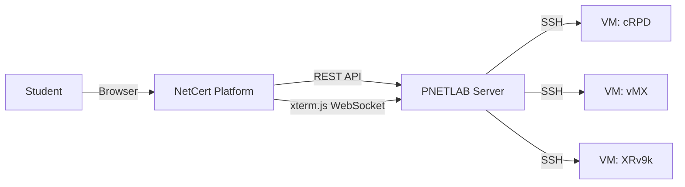
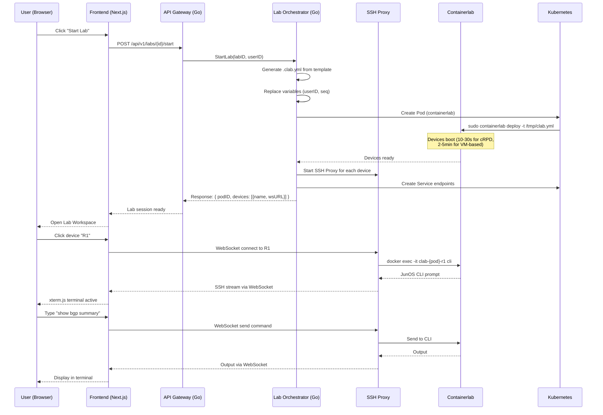
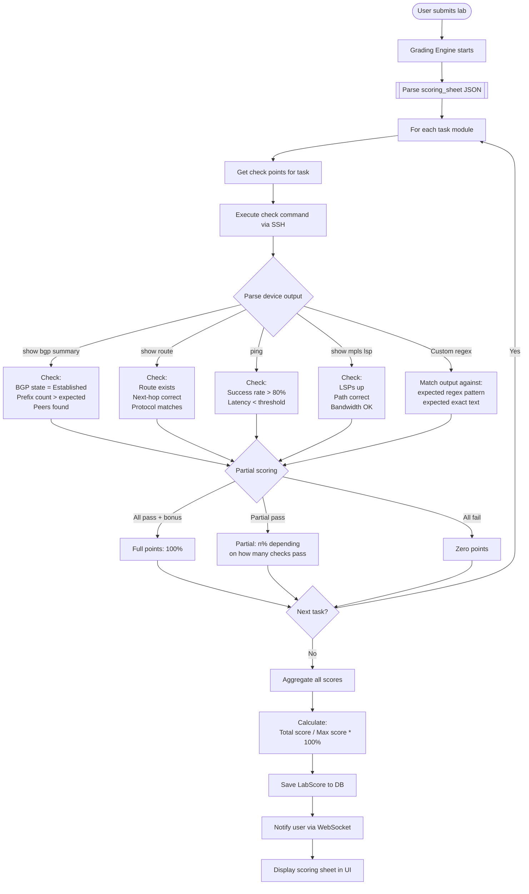
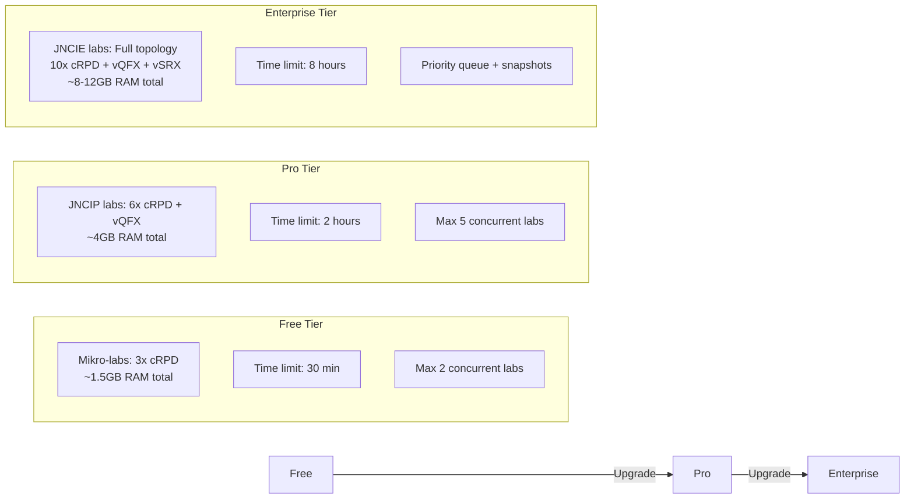
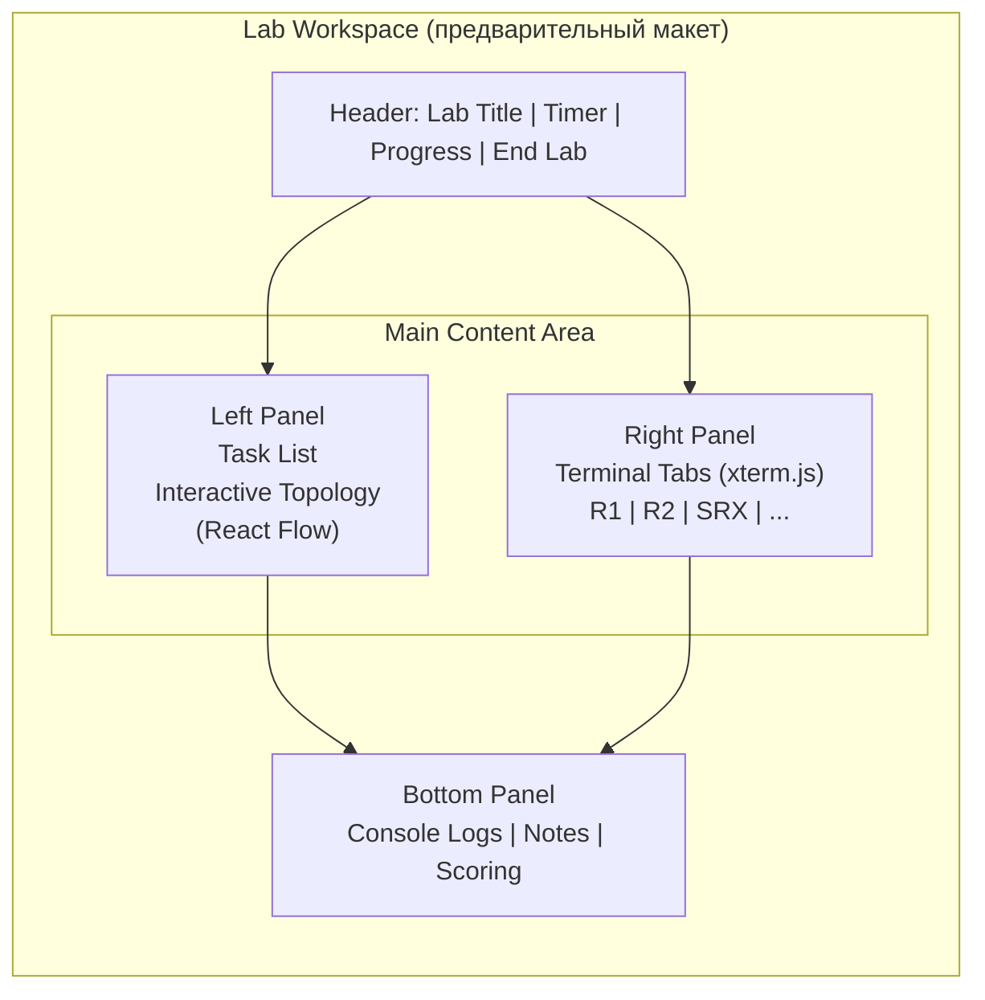

# NetCert Lab Methodology

> **Версия:** 1.0  
> **Дата:** Май 2026  
> **Автор:** NetCert Pro Architecture Team

---

## 1. Обзор архитектуры лаб

NetCert использует **многоуровневый подход** к лабораторным работам:

| Уровень | Платформа | Назначение | Уровни экзаменов |
|---------|-----------|------------|------------------|
| **1. Теоретические микро-лабы** | SVG + React Flow (симуляция) | Иллюстрация концептов без live-устройств | JNCIA, CCNA |
| **2. Эмулированные микро-лабы** | Containerlab (cRPD) | Практика отдельных технологий | JNCIA, JNCIS, CCNA, CCNP |
| **3. Полные экзаменационные лабы** | Containerlab (cRPD + vQFX + vSRX) | Подготовка к JNCIP/JNCIE | JNCIP, JNCIE, CCNP, CCIE |
| **4. PNETLAB / EVE-NG (опционально)** | VM-based (vMX, XRv9k) | Для высокоточных симуляций | JNCIE, CCIE |

---

## 2. JunOS Shell — Оболочки для лаб

### 2.1. cRPD (Containerized Routing Protocol Daemon)

**Описание:** Легковесный JunOS-демон маршрутизации, запускается в Docker-контейнере.

**Требования:**
- RAM: от 512MB
- CPU: 1 vCPU
- Диск: 500MB
- ОС: Linux с Docker

**Получение образа:**
```bash
# cRPD распространяется через Juniper Networks.
# После получения license — скачать .tgz с портала Juniper
docker load -i juniper-crpd-24.2R1.tgz
docker tag crpd:24.2R1 myregistry/crpd:24.2R1
```

**Запуск через Containerlab:**
```yaml
name: simple-bgp-lab
topology:
  nodes:
    r1:
      kind: juniper_crpd
      image: crpd:24.2R1
      mgmt-ipv4: 172.100.1.2
    r2:
      kind: juniper_crpd
      image: crpd:24.2R1
      mgmt-ipv4: 172.100.1.3
  links:
    - endpoints: ["r1:eth1", "r2:eth1"]
```

**Доступ к CLI:**
```bash
# Через SSH
ssh admin@172.100.1.2

# Через docker exec (быстрее, без SSH)
docker exec -it clab-simple-lab-r1 cli

# Через WebSocket (в браузере — xterm.js)
# URL: ws://netcert.local/api/v1/ws/lab/{submissionId}/r1
```

**Базовые команды JunOS:**
```junos
# Operational mode
show bgp summary
show route protocol bgp
show ospf neighbor
show isis adjacency
show mpls lsp
show configuration

# Configuration mode
configure
set interfaces ge-0/0/0 unit 0 family inet address 10.0.0.1/30
set protocols bgp group EBGP type external
commit
commit and-quit
```

**Ограничения cRPD:**
- Нет аппаратного форвардинга (только control plane)
- Некоторые show-команды возвращают mock-данные
- Нет поддержки всех interface types (только ge-, lo0-)
- Нет SRX firewall функциональности

### 2.2. vMX (Virtual MX Router)

**Описание:** Полноценный JunOS-router, запускается как VM через vrnetlab.

**Требования:**
- RAM: от 4GB на ноду
- CPU: 2 vCPU
- KVM: обязательно (VT-x/AMD-V)
- Диск: 10GB

**Запуск через Containerlab:**
```yaml
name: vmx-lab
topology:
  nodes:
    pe1:
      kind: juniper_vmx
      image: vrnetlab/vr-vmx:24.2R1
    pe2:
      kind: juniper_vmx
      image: vrnetlab/vr-vmx:24.2R1
```

### 2.3. vSRX (Virtual SRX Firewall)

**Описание:** Juniper firewall в VM, полный набор security-функций.

**Требования:**
- RAM: от 2GB на ноду
- CPU: 2 vCPU
- KVM: обязательно

**Запуск:**
```yaml
name: srx-lab
topology:
  nodes:
    srx:
      kind: juniper_vsrx
      image: vrnetlab/vr-vsrx:23.2R2
```

**Ключевые security-команды:**
```junos
show security policies
show security zones
show security ipsec security-associations
show security nat source rule
show security log

configure
set security policies from-zone trust to-zone untrust policy allow-all match source-address any
set security zones security-zone trust interfaces ge-0/0/0.0
```

---

## 3. Cisco Shell — Оболочки для лаб

### 3.1. XRv9k (Cisco IOS-XR)

**Описание:** Полноценный IOS-XR роутер в VM.

**Требования:**
- RAM: от 8GB на ноду ⚠
- CPU: 2-4 vCPU
- KVM: обязательно

**Запуск:**
```yaml
name: cisco-lab
topology:
  nodes:
    xr1:
      kind: cisco_xrv9k
      image: vrnetlab/vr-xrv9k:7.10.1
```

**Базовые команды IOS-XR:**
```cisco
# Operational mode
show bgp summary
show bgp neighbors
show route ipv4 unicast
show ospf neighbor
show isis adjacency
show mpls lsp
show running-config

# Configuration mode
configure terminal
router bgp 65001
  neighbor 10.0.0.1 remote-as 65002
  !
!
commit
```

### 3.2. CSR1000v (Cisco IOS-XE)

**Описание:** Enterprise-роутер, легче XRv9k.

**Требования:**
- RAM: от 3GB
- CPU: 1-2 vCPU

**Запуск:**
```yaml
name: csr-lab
topology:
  nodes:
    csr1:
      kind: cisco_csr1000v
      image: vrnetlab/vr-csr:17.9.1
```

### 3.3. NX-OS (Cisco Nexus)

**Описание:** Для Data Center топологий (VXLAN/EVPN).

**Запуск:**
```yaml
name: nxos-lab
topology:
  nodes:
    nxos-spine1:
      kind: cisco_n9kv
      image: vrnetlab/vr-n9kv:10.3.1
```

---

## 4. PNETLAB — Среда для ручных лаб

### 4.1. Когда использовать PNETLAB

PNETLAB **НЕ ИСПОЛЬЗУЕТСЯ** как бэкенд для NetCert (мы используем Containerlab). Однако PNETLAB может быть полезен:

- Как дополнительная среда для самостоятельной практики студентов
- Для лаб, требующих VM-образы, которые не поддерживаются Containerlab
- Для изолированного тестирования сложных топологий

### 4.2. Сравнение PNETLAB и Containerlab

| Характеристика | PNETLAB | Containerlab |
|---------------|---------|--------------|
| **Тип** | VM-based (QEMU/KVM) | Container-based (Docker) |
| **Время запуска** | 3-10 минут | 10-30 секунд |
| **RAM на ноду** | 2-8GB | 512MB-4GB |
| **API** | Нестабильный | YAML + CLI + REST |
| **Мультитенантность** | Нет | Да (через K8s) |
| **Auto-grading** | Нет | Да (через Python/Go) |
| **Обновления** | Нестабильные | Активные |

### 4.3. Интеграция PNETLAB с NetCert (опционально)



> **Важно:** PNETLAB integration — опциональна и не является частью основного roadmap. Containerlab — единственный officially supported бэкенд.

---

## 5. Ссылки на оболочки в открытом доступе

### 5.1. Juniper

| Ресурс | Тип | Ссылка | Доступность |
|--------|-----|--------|-------------|
| **Juniper vLabs** | Бесплатные онлайн-лабы | https://vlab.juniper.net | Бесплатно, требует регистрацию |
| **Juniper TechLibrary** | Официальная документация | https://www.juniper.net/documentation/ | Бесплатно |
| **Juniper Learning Portal** | Курсы + J-Care | https://learningportal.juniper.net | Подписка |
| **Juniper cRPD Docker** | Container-образ | Через Juniper Support Portal | Требуется license |
| **Juniper J-Web** | Web-интерфейс управления | Built-in на SRX/MX | Встроенный |

### 5.2. Cisco

| Ресурс | Тип | Ссылка | Доступность |
|--------|-----|--------|-------------|
| **Cisco DevNet Sandbox** | Бесплатные онлайн-лаб | https://devnetsandbox.cisco.com | Бесплатно, требует регистрацию |
| **Cisco Modeling Labs (CML)** | Локальная симуляция | https://www.cisco.com/go/cml | Платная |
| **Cisco DevNet Always-On** | Всегда доступные лабы | https://devnetsandbox.cisco.com/RM/Topology | Бесплатно |
| **Cisco IOS-XE WebUI** | Web-интерфейс | Built-in на CSR1000v/Catalyst 9000 | Встроенный |
| **Cisco Open SD-Access Sandbox** | SD-Access | https://devnetsandbox.cisco.com | Бесплатно, по записи |

### 5.3. Containerlab

| Ресурс | Тип | Ссылка |
|--------|-----|--------|
| **Containerlab Docs** | Официальная документация | https://containerlab.dev |
| **Containerlab Labs** | Примеры топологий | https://containerlab.dev/lab-examples/ |
| **Containerlab Kinds** | Справочник по устройствам | https://containerlab.dev/manual/kinds/ |
| **vrnetlab** | VM-wrapper для CLab | https://github.com/vrnetlab/vrnetlab |
| **srlinux + netlab** | Альтернативный стек | https://netlab.tools/ |

---

## 6. Архитектура Lab Engine

### 6.1. Запуск лаборатории: Sequence Diagram



### 6.2. Auto-Grading Engine: Flowchart



### 6.3. JSON-структура интерактивной топологии (React Flow)

```json
{
  "nodes": [
    {
      "id": "cr1",
      "type": "router",
      "position": { "x": 250, "y": 50 },
      "data": {
        "label": "CR1",
        "type": "router",
        "vendor": "juniper",
        "image": "crpd:24.2R1",
        "mgmt_ip": "172.100.1.2",
        "status": "up",
        "interfaces": [
          { "id": "ge-0/0/0", "status": "up", "neighbor": "cr2", "ip": "10.0.0.0/31" },
          { "id": "ge-0/0/1", "status": "up", "neighbor": "ag1", "ip": "10.0.1.0/31" },
          { "id": "ge-0/0/2", "status": "up", "neighbor": "srx", "ip": "10.0.2.0/31" }
        ],
        "configuration": {
          "hostname": "CR1",
          "protocols": ["IS-IS", "BGP", "MPLS"],
          "router_id": "1.1.1.1"
        },
        "progress": {
          "current_task": "Module 3 — BGP Peering",
          "task_status": "in_progress",
          "score": 65
        }
      }
    },
    {
      "id": "cr2",
      "type": "router",
      "position": { "x": 450, "y": 50 },
      "data": {
        "label": "CR2",
        "type": "router",
        "vendor": "juniper",
        "image": "crpd:24.2R1",
        "status": "up",
        "interfaces": [
          { "id": "ge-0/0/0", "status": "up", "neighbor": "cr1", "ip": "10.0.0.2/31" },
          { "id": "ge-0/0/1", "status": "down", "neighbor": "ag2", "ip": "10.0.3.0/31" }
        ],
        "configuration": {
          "hostname": "CR2",
          "protocols": ["IS-IS", "BGP", "MPLS"],
          "router_id": "2.2.2.2"
        },
        "progress": {
          "current_task": "M2 — IS-IS Backbone",
          "task_status": "fault_injected",
          "score": 30
        }
      }
    },
    {
      "id": "srx",
      "type": "firewall",
      "position": { "x": 150, "y": 250 },
      "data": {
        "label": "SRX-1",
        "type": "firewall",
        "vendor": "juniper",
        "image": "vrnetlab/vr-vsrx:23.2R2",
        "status": "up",
        "interfaces": [
          { "id": "ge-0/0/0", "status": "up", "neighbor": "cr1", "ip": "10.0.2.1/31" },
          { "id": "ge-0/0/1", "status": "up", "neighbor": "cust1", "ip": "192.168.1.1/24" }
        ],
        "configuration": { "hostname": "SRX-1", "protocols": ["BGP", "IPsec"], "security_zones": ["trust", "untrust", "dmz"] }
      }
    }
  ],
  "edges": [
    {
      "id": "cr1-cr2",
      "source": "cr1",
      "target": "cr2",
      "sourceHandle": "ge-0/0/0",
      "targetHandle": "ge-0/0/0",
      "type": "smoothstep",
      "animated": true,
      "style": { "stroke": "var(--svg-line-active)", "strokeWidth": 3 },
      "data": {
        "protocol": "IS-IS L2",
        "bandwidth": "10G",
        "status": "up",
        "metric": 10
      }
    },
    {
      "id": "cr1-ag1",
      "source": "cr1",
      "target": "ag1",
      "sourceHandle": "ge-0/0/1",
      "type": "smoothstep",
      "animated": true,
      "style": { "stroke": "var(--svg-line-active)", "strokeWidth": 2 },
      "data": { "protocol": "IS-IS L1", "bandwidth": "1G", "status": "up" }
    },
    {
      "id": "cr2-ag2",
      "source": "cr2",
      "target": "ag2",
      "sourceHandle": "ge-0/0/1",
      "type": "smoothstep",
      "animated": false,
      "style": { "stroke": "var(--svg-line-down)", "strokeWidth": 2, "strokeDasharray": "6,4" },
      "data": { "protocol": "IS-IS L1", "bandwidth": "1G", "status": "down", "reason": "Interface shutdown" }
    }
  ],
  "viewport": { "x": 0, "y": 0, "zoom": 1 }
}
```

### 6.4. Таблица ресурсоёмкости нод

| Устройство | Kind | RAM min | CPU | Disk | Тип | Time to boot | Лучший уровень | Примечание |
|-----------|------|---------|-----|------|-----|-------------|---------------|------------|
| **Juniper cRPD** | `juniper_crpd` | 512MB | 1 | 500MB | Container | 5-10s | JNCIA–JNCIP | Основной выбор для большинства лаб |
| **Juniper vQFX** | `juniper_vqfx` | 2GB | 2 | 5GB | VM (vrnetlab) | 60-120s | JNCIP–JNCIE | Для EVPN-VXLAN, MC-LAG |
| **Juniper vMX** | `juniper_vmx` | 4GB | 2 | 10GB | VM (vrnetlab) | 120-300s | JNCIE | Только если cRPD недостаточно |
| **Juniper vSRX** | `juniper_vsrx` | 2GB | 2 | 5GB | VM (vrnetlab) | 60-180s | JNCIP–JNCIE | Для security-лаб |
| **Cisco XRv9k** | `cisco_xrv9k` | 8GB ⚠ | 4 | 10GB | VM (vrnetlab) | 180-300s | CCNP–CCIE | Очень тяжёлый, ограниченно |
| **Cisco CSR1000v** | `cisco_csr1000v` | 3GB | 2 | 5GB | VM (vrnetlab) | 60-180s | CCNA–CCNP | Альтернатива XRv9k |
| **Cisco N9Kv** | `cisco_n9kv` | 4GB | 2 | 8GB | VM (vrnetlab) | 120-240s | CCNP–CCIE | Для VXLAN/EVPN DC |

### 6.5. Стратегия распределения ресурсов по уровням



---

## 7. Injecting Faults (Механизм "поломок")

### 7.1. Концепция

Injected faults — ключевая особенность JNCIE-симулятора. Каждый troubleshooting-модуль стартует с преднамеренно сломанной конфигурацией.

### 7.2. Типы faults

| Тип | Описание | Пример | Команда инъекции |
|-----|----------|--------|-----------------|
| **Interface shutdown** | Интерфейс выключен | CR2 ge-0/0/1 down | `set interfaces ge-0/0/0 disable` |
| **Wrong BGP config** | Неверный AS/next-hop | BGP peering не заходит | `set protocols bgp group EBGP peer-as 65100` (wrong AS) |
| **Route-map ошибка** | Неверный permit/deny | Префиксы не анонсируются | `set policy-options policy-statement EXPORT term 1 then reject` |
| **OSPF/IS-IS mismatch** | Несовпадение параметров | Adjacency не формируется | `set protocols ospf area 0.0.0.1` (area mismatch) |
| **MTU проблема** | MTU mismatch | BGP flapping | `set interfaces ge-0/0/0 mtu 1400` |
| **Фильтр/политика** | Неверный firewall filter | Трафик дропается | `set firewall family inet filter BLOCK term 1 then discard` |
| **Label allocation** | Неверный label | MPLS LSP down | `set protocols mpls label-range 1000000-1000100` (wrong range) |
| **Время/синхронизация** | Clock skew | Certificates invalid | `set system time 2023-01-01` (back in time) |

### 7.3. Техническая реализация

```python
# Пример: Python-скрипт инъекции fault для модуля "BGP Session Flap"
def inject_fault_bgp_flap(device_ssh, task_config):
    """Inject MTU mismatch on BGP peering interface"""
    
    interface = task_config.get("target_interface", "ge-0/0/0")
    mtu_size = task_config.get("mtu_size", 1400)
    
    commands = [
        "configure",
        f"set interfaces {interface} unit 0 family inet mtu {mtu_size}",
        f"set interfaces {interface} mtu {mtu_size}",
        "commit",
        "exit"
    ]
    
    for cmd in commands:
        device_ssh.send_command(cmd, expect_prompt=True)
    
    # Verify fault is active
    check = device_ssh.send_command(f"show interfaces {interface} | match mtu")
    assert str(mtu_size) in check, "Fault injection failed!"
    
    return {"fault_injected": True, "module": "bgp-flapping"}
```

### 7.4. Timing faults

```python
# Faults активируются в определённое время модуля
fault_schedule = {
    "module_2": {
        "start_after_minutes": 0,  # Сразу при старте модуля
        "faults": [
            {"target": "cr2", "type": "wrong_net_id", "config": "...initial config with wrong NET..."}
        ]
    },
    "module_9": {
        "start_after_minutes": 5,  # Через 5 минут после начала модуля
        "faults": [
            {"target": "cr1", "type": "mtu_mismatch", "config": "set interfaces ge-0/0/0 mtu 1400"}
        ]
    }
}
```

---

## 8. Микро-лабы для JNCIA / JNCIS / JNCIP

### 8.1. Концепция Concept Micro-Labs

Микро-лаба — это небольшая (5-15 минут) лабораторная работа, встроенная непосредственно в теоретическую главу.

**Пример:** В главе "OSPF LSA Types" пользователь видит кнопку "Попробовать в лабе". Нажатие открывает мини-топологию из 3 роутеров cRPD с предварительно настроенной задачей.

### 8.2. Progressive Disclosure

```
Уровень 1 (JNCIA): Настройка IP-адресов
  ├── Задача: Сконфигурировать IP на интерфейсах R1 и R2
  ├── Подсказки: Доступны (нажми "Hint")
  └── Время: 5 минут

Уровень 2 (JNCIS): Поднять OSPF
  ├── Задача: Настроить OSPF Area 0, проверить adjacency
  ├── Подсказки: Ограничены (2 hints)
  └── Время: 10 минут

Уровень 3 (JNCIP): Troubleshooting OSPF
  ├── Задача: Почему не формируется adjacency?
  ├── Injected fault: MTU mismatch на интерфейсе
  ├── Подсказки: Нет
  └── Время: 15 минут
```

### 8.3. Интеграция с учебными материалами (БД)

```sql
-- Связь микро-лабы с главой
CREATE TABLE micro_labs (
    id UUID PRIMARY KEY DEFAULT gen_random_uuid(),
    slug VARCHAR(100) UNIQUE NOT NULL,
    title VARCHAR(200) NOT NULL,
    description TEXT,
    difficulty INT CHECK (difficulty BETWEEN 1 AND 5),
    duration_minutes INT NOT NULL DEFAULT 15,
    topology_yaml TEXT NOT NULL,           -- Containerlab YAML
    initial_configs JSONB NOT NULL,        -- Начальные конфиги для каждого устройства
    task_description TEXT NOT NULL,         -- Описание задачи для пользователя
    hints TEXT[],                          -- Массив подсказок (постепенное раскрытие)
    solution_configs JSONB,                -- Эталонная конфигурация
    grading_script TEXT,                   -- Python-скрипт проверки
    fault_config JSONB,                    -- Конфигурация injected fault (если есть)
    is_troubleshooting BOOLEAN DEFAULT false,
    technology VARCHAR(50),                -- BGP, OSPF, MPLS, etc.
    track_id UUID REFERENCES tracks(id),
    is_active BOOLEAN DEFAULT true,
    created_at TIMESTAMPTZ DEFAULT NOW()
);

-- Связь микро-лабы с главой/learning objectives
CREATE TABLE chapter_micro_labs (
    chapter_id UUID REFERENCES certain_chapter_table(id),
    micro_lab_id UUID REFERENCES micro_labs(id),
    sort_order INT DEFAULT 0,
    is_required BOOLEAN DEFAULT false,
    PRIMARY KEY (chapter_id, micro_lab_id)
);
```

---

## 9. PM2: Lab Workspace UI



---

## 10. Next Steps

1. Создать базовый `LabOrchestrator` Go-сервис (deploy Containerlab YAML)
2. Настроить SSH-прокси для WebSocket→Containerlab connection
3. Реализовать Auto-Grading Engine (Python/PyATS скрипты)
4. Создать React Flow топологию для JNCIE-ENT
5. Написать 5 микро-лаб для OSPF, BGP, MPLS (JNCIA–JNCIP)
6. Протестировать JNCIE-ENT 8-hour симуляцию
